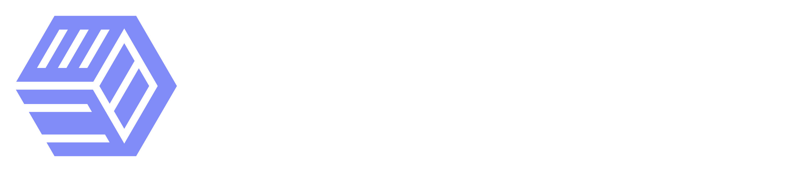
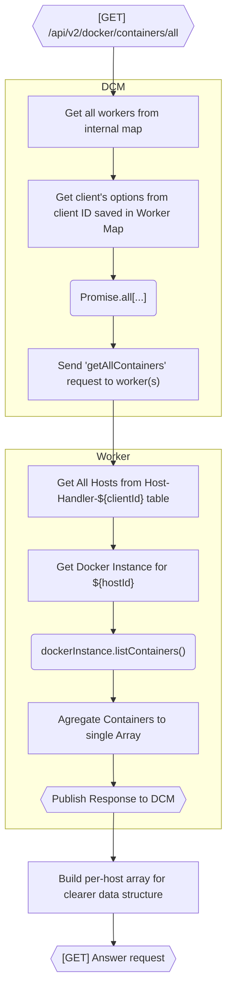

<p align="center">
  
</p>

<p align="center">
  <a href="https://dockstat.itsnik.de" title="Wiki">
    
  </a>
  <a href="#key-features" title="Features">
    
  </a>
  <a href="#getting-started-developer-local" title="Getting started (developer)">
    
  </a>
  <a href="#stacks-dockstore" title="DockStore">
    
  </a>
  <a href="#development-workflow-guidelines" title="Development guide">
    
  </a>
</p>

---

<p align="center">
  
  
  
  
  <br />
  
  
  
  
</p>

DockStat is an extensible container administration and monitoring platform that aims to combine the best ideas from tools like Portainer, Grafana and Dockge into a single, modular solution. It focuses on real-world manageability, deep observability and a runtime plugin-first architecture so the platform can evolve with your stack.

> ⚠️ Disclaimer  
> DockStat is currently in **Pre-Alpha**. Expect breaking changes, missing features and instability. Use for testing and evaluation only unless you know it's suitable for your environment.

---

## Project overview

DockStat's goal is to be the unified UI and runtime for managing containerized infrastructures (Docker for now, with intentions to expand). It provides:

- A responsive web UI for container & stack lifecycle operations.
- A monitoring layer with table and graph views and network visualizations.
- A runtime plugin system that supports frontend components, backend services and full-stack plugins.
- Stack and template management (prebuilt Docker Compose templates, stack-level plugins).
- Multi-node monitoring via adapters that let a single DockStat instance manage multiple Docker hosts.

---

## Key features

- Runtime-compatible plugin system:
  - Frontend UI components (widgets, pages)
  - Backend services (notification providers, integrations with other software)
  - Full-stack plugins (both frontend and backend)
- Theming:
  - CSS variable driven theming for deep customization
- Stacks & Templates:
  - Prebuilt Docker Compose templates (DockStore)
  - Stack-level plugin hooks (Traefik/Caddy examples)
  - Automatic DockNode provisioning (e.g. Hetzner Cloud plugin)
  - Future: Kubernetes support (?)
- Monitoring & Visualization:
  - Table-based and graph-based metrics
  - Network visualization with sigma.js / reagraph
  - Whole-stack monitoring (containers, services, networks)
- Custom Dashboards:
  - Home-Assistant style widget system extendable via plugins
- Multi-Node Monitoring:
  - Adapters abstract different backends (local Docker, remote Docker API, SSH, etc.)
  - Per-adapter configuration and credentials
- Extensible datastore:
  - Lightweight persistence (bun:sqlite used in current prototypes) for local storage and historic metrics

---

## Tech stack

- Frontend: TypeScript, TailwindCSS, Framer-Motion, lucide-react, Simple-Icons-React
- Backend: ElysiaJS, Dockerode, bun:sqlite, @dockstat/\*
- Monorepo layout: apps/, packages/ (typings, db, sql-wrapper, plugins, ...)

---

## Repo structure (high level)

- apps/
  - `api` [Container]: The backend which leverages ElysiaJS's speed and various `@dockstat/*` packages
  - `dockstat` [Container]: Main frontend / UI app (React)
  - `dockstore-validator` [Container]: An ElysiaJS + HTMX based application for manual approving of Plugins; stores version hashes of the Plugins to be compared pre-installation by DockStatAPI (has to be enabled for a repository).
  - `dockstore`: — community hub for templates, themes & plugins (Markdown only for now)
  - `docs`: — documentation (mirrored from [Outline](https://dockstat.itsnik.de))
- packages/
  - `db`: DockStatAPI DB Setup
  - `docker-client`: A Docker Client Manager package, that splits up each client into a seperate Bun Worker
  - `logger` [PUBLIC]: An extensible Logger which also proxies logs to a Websocket (`/api/v2/ws/logs`)
  - `outline-sync` [PUBLIC]: A synchronisation library to mirror an external Outline Wiki to a local filesystem
  - `plugin-builder` [PUBLIC]: A package to make building Plugins for DockStat easier
  - `sqlite-wrapper` [PUBLIC]: Self-built ORM with full typesafety, parsing and validation for `bun:sqlite` for optimal performance
  - `template-renderer`: Helper library to allow usage of Frontend Plugins in DockStat
  - `typings` [PUBLIC]: Shared typings
  - `ui`: DockStat's UI library
  - `utils` [PUBLIC]: Various utils used across DockStat

---

## Getting started (developer / local)

Requirements

- Bun
- Docker

Quick start (from Repo root)

1. Install dependencies:

```bash
bun install
```

2. Start `dockstat` and `@dockstat/api` in development:

```bash
bun run dev:dockstat
# bun run docker-up && bun run dev --filter=@dockstat/frontend --filter=@dockstat/api
```

---

## Plugin system (overview)

DockStat is designed to grow through plugins. Plugins can register new pages, provide backend services (collectors, adapters, provisioning modules), or both.

Plugin types

- Frontend plugin: Registers routes, pages or widgets in the UI. Usually provides data loaders, pages and actions.
- Backend plugin: Runs a process/service that collects metrics, talks to external APIs or adds adapters for new node types.
- Full-stack plugin: Includes both frontend and backend parts and ships as a single distributable.

Concepts

- Lifecycle: Plugins are discovered at runtime and may be started/stopped without recompiling the host (validation of plugins can be done through `dockstore-validator`, if enabled).

Developer notes

- Keep plugin APIs minimal; prefer well-documented typed contracts.

---

## Plugins, Themes & Stacks - DockStore

DockStore serves as the ecosystem hub for reusable assets:

- Docker‑Compose templates – ready‑made stacks for common services (AdGuard, Grafana, Home Assistant, Arr‑suite, etc.).
- Themes & UI tweaks – community‑crafted visual customisations.
- Plugin marketplace – a registry where developers can publish and discover plugins.

> Add your own templates, plugins or themes under `apps/dockstore/src/content/<plugins,themes,stacks>` (or via git sub‑modules) to make them discoverable by the platform.

---

## Multi-node

DockStat separates data collection from visualisation, enabling scalable monitoring across many Docker hosts.

### Agregation

Agregation is done by querying workers, which can respond as soon as the data is gathered, without halting the entire backend.

#### Example Docker-Client-Manager request Lifecycle



---

## Development workflow & guidelines

> [!TIP]
> Please follow the Patterns mentioned in the Wiki: [Patterns](https://outline.itsnik.de/s/dockstat/doc/patterns-bHRdz02Jsy)

- Each app/package should have its own README and local dev scripts.
- Use TypeScript and JSDoc for public APIs.
- Follow repository linting and formatting rules (see root scripts and package.json).
- CI should run type checks, linters and tests on PRs.

Common scripts

- bun run dev — start development servers
- bun run build — build production bundles
- bun run lint — linting and type checks

Adding an app

- Create directory in apps/
- Add package.json with scripts (dev/build/lint/check-types)
- Add tsconfig.json extending root config
- Update root workspace config if needed

---

## Known limitations & stability

- Pre-Alpha: expect breaking API and UX changes.
- Limited production hardening; use only for testing.
- Some features (Kubernetes support, advanced alerting, long-term metrics storage) are planned but not yet implemented.

---

## Contributing

Contributions, ideas and bug reports are welcome.

- Check the Wiki for developer docs and architecture notes
- Open issues for bugs or feature requests
- Submit PRs with small, focused changes and good descriptions
- If you're writing a plugin or template, prefer adding it to apps/dockstore for discoverability; Can be done through git-submodules

---

## Documentation & Support

Start with the [Outline docs](https://dockstat.itsnik.de), if there are still questions about DockStat feel free to start a new discussion :)

---

## License

> [Mozilla Public License Version 2.0](https://www.mozilla.org/en-US/MPL/2.0/)
