id: api-architecture-overview
title: API Architecture Overview
collectionId: b4a5e48f-f103-480b-9f50-8f53f515cab9
parentDocumentId: 7dddd764-6483-4f84-96a3-988304e772d3
updatedAt: 2026-01-01T15:02:00.000Z
urlId: api-architecture-overview
---

> The DockStat API is a modern, high-performance web API built on Bun and Elysia, designed to manage Docker containers, handle real-time monitoring, and provide extensible plugin capabilities.

## High-Level Architecture

The DockStat API follows a layered architecture with clear separation of concerns, enabling maintainability and scalability.

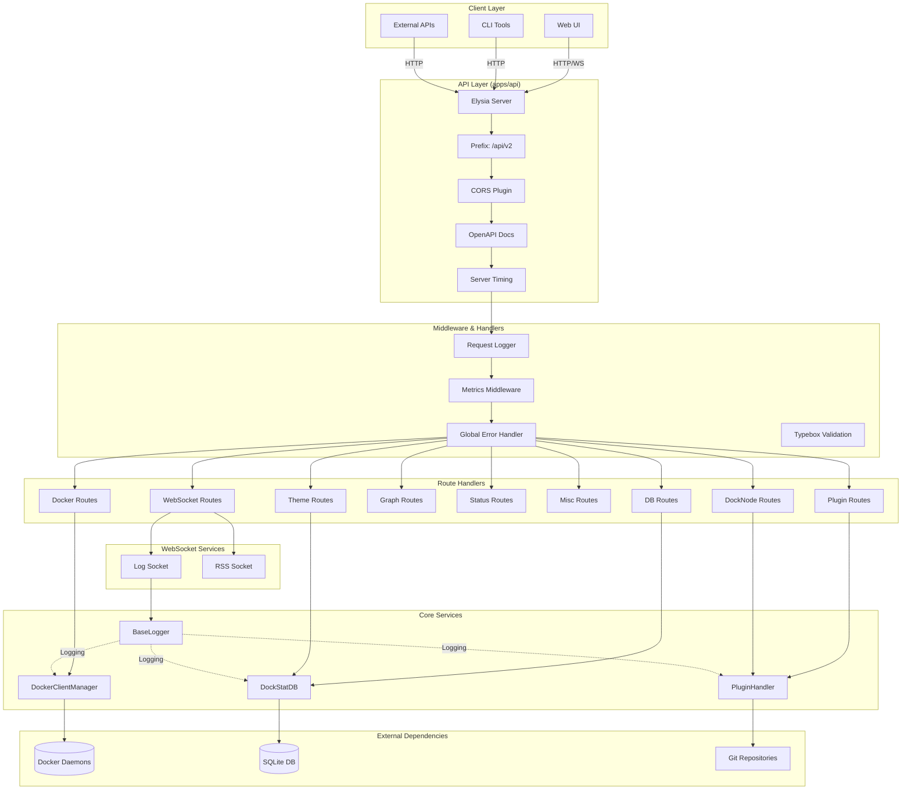

## Core Components

### 1. Elysia Server

The Elysia server serves as the HTTP/websocket framework and is the entry point for all API requests.

**Configuration:**
- **Base URL Prefix**: `/api/v2`
- **Default Port**: `3030` (configurable via `DOCKSTATAPI_PORT`)
- **Precompilation**: Enabled for performance
- **Runtime**: Bun

**Key Features:**
- Type-safe route definitions with TypeScript
- Automatic OpenAPI documentation generation
- Built-in request/response validation using Typebox
- WebSocket support with typed interfaces
- Plugin architecture for extensibility

### 2. Middleware Stack

The API employs a layered middleware approach that processes requests in a specific order.

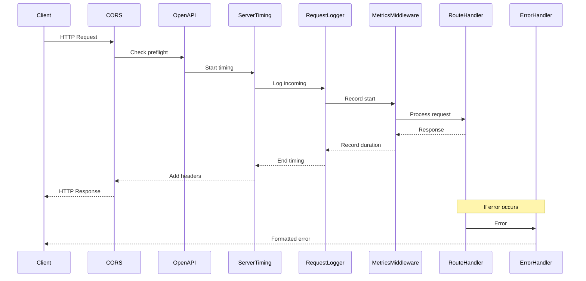

**Middleware Components:**

1. **CORS** (`@elysiajs/cors`)
   - Handles cross-origin requests
   - Essential for web UI integration

2. **OpenAPI** (`@elysiajs/openapi`)
   - Generates interactive API documentation
   - Provider: Scalar
   - Path: `/api/v2/docs`

3. **Server Timing** (`@elysiajs/server-timing`)
   - Tracks request lifecycle timing
   - Configurable via `DOCKSTATAPI_SHOW_TRACES`
   - Measures: parse, handle, transform, beforeHandle, afterHandle, mapResponse, error, total

4. **Request Logger**
   - Logs incoming HTTP requests
   - Captures method, path, status, duration
   - Forwards logs to WebSocket clients

5. **Metrics Middleware**
   - Collects Prometheus-style metrics
   - Tracks request counts and durations
   - Monitors system resources

6. **Global Error Handler**
   - Centralized error processing
   - Structured error responses
   - Differentiates between validation, parse, and internal errors

### 3. Route Organization

Routes are organized by domain and feature, each in its own module.

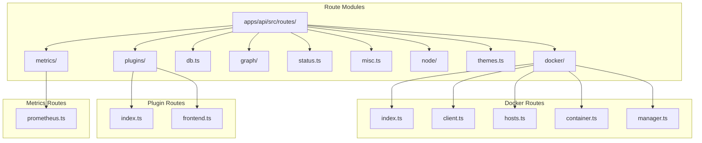

**Route Structure by Domain:**

| Domain | Path | Purpose |
|--------|------|---------|
| **Docker** | `/api/v2/docker` | Manage Docker clients, hosts, and containers |
| **Plugins** | `/api/v2/plugins` | Plugin installation, activation, and routing |
| **Database** | `/api/v2/db` | Configuration and data management |
| **Graph** | `/api/v2/graph` | Visual data representations |
| **Status** | `/api/v2/status` | Health and status endpoints |
| **Misc** | `/api/v2/*` | Miscellaneous utility endpoints |
| **DockNode** | `/api/v2/node` | Remote agent integration |
| **Themes** | `/api/v2/themes` | Theme management |
| **WebSockets** | `/ws/*` | Real-time communication |
| **Metrics** | `/api/v2/metrics` | Prometheus metrics |

### 4. Core Services

#### DockerClientManager (DCM)

Manages connections to multiple Docker daemons through a worker pool architecture.

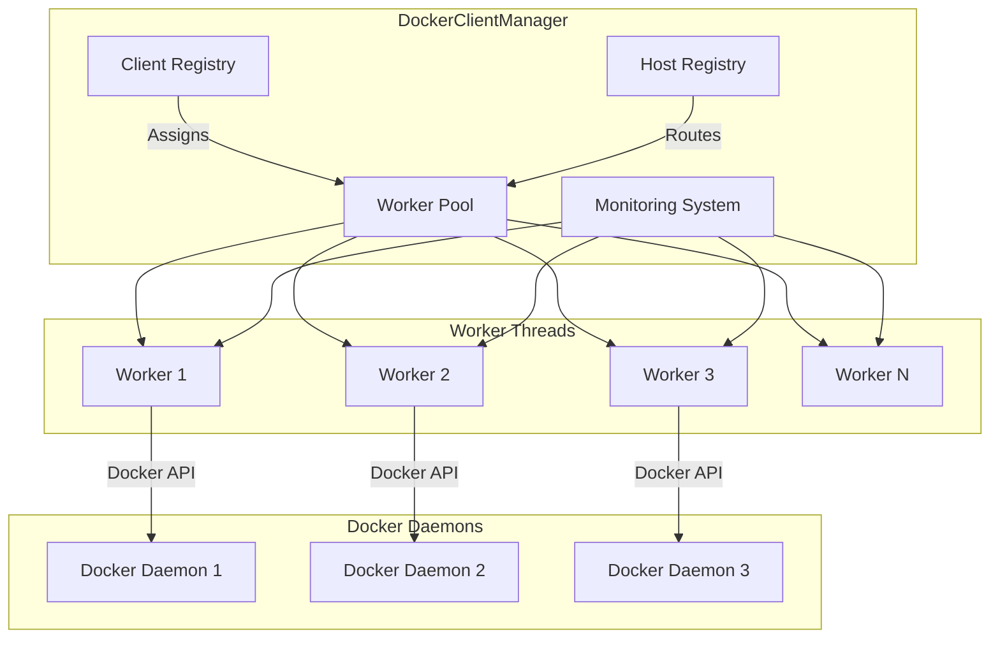

**Features:**
- Multi-client support (register multiple Docker environments)
- Worker pool for parallel operations
- Real-time container statistics streaming
- Event-driven monitoring
- Automatic reconnection handling
- Resource usage tracking

#### PluginHandler

Manages the plugin lifecycle and provides extension capabilities.

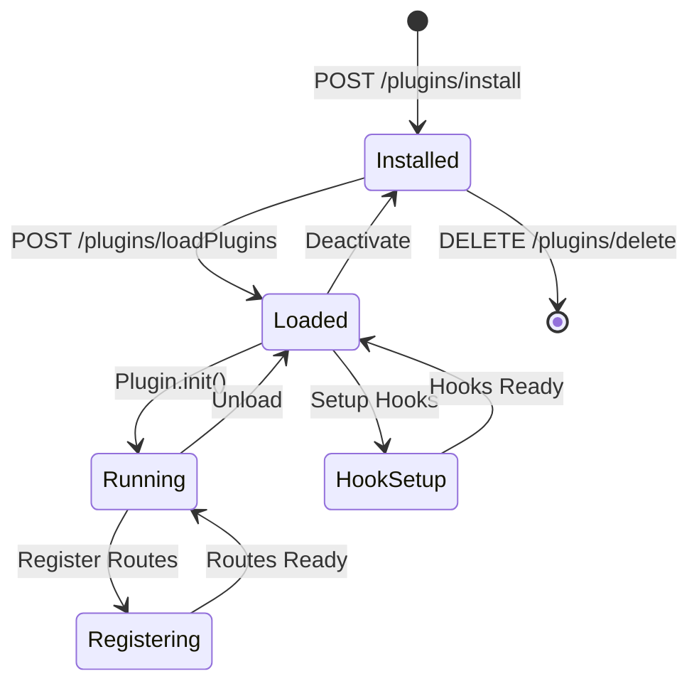

**Plugin Capabilities:**
- Custom API routes via Elysia instances
- Database table creation and management
- Event hooks for container lifecycle
- Action chains for request/response processing
- Dynamic code loading

#### DockStatDB

Database layer providing access to configuration, plugins, repositories, and metrics.

**Database Schema:**

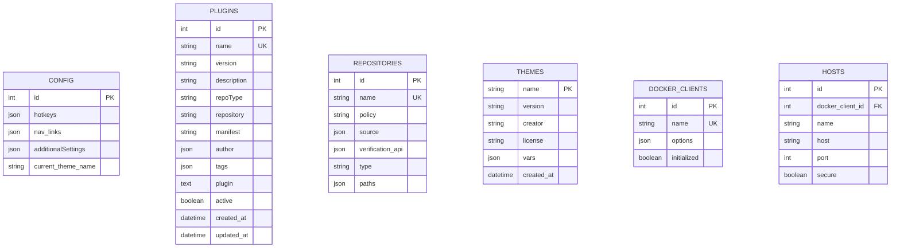

### 5. WebSocket Services

Real-time communication channels for logs and RSS feeds.

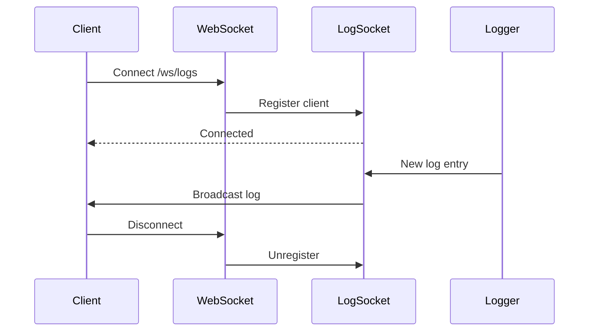

**WebSocket Endpoints:**
- `/ws/logs` - Real-time log streaming
- `/ws/rss` - RSS feed updates (planned)

## Data Flow Architecture

### Request Processing Flow

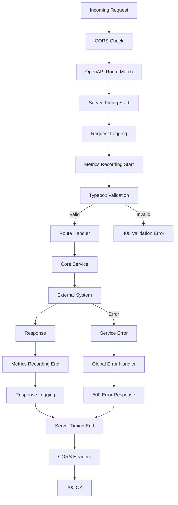

### Container Monitoring Flow

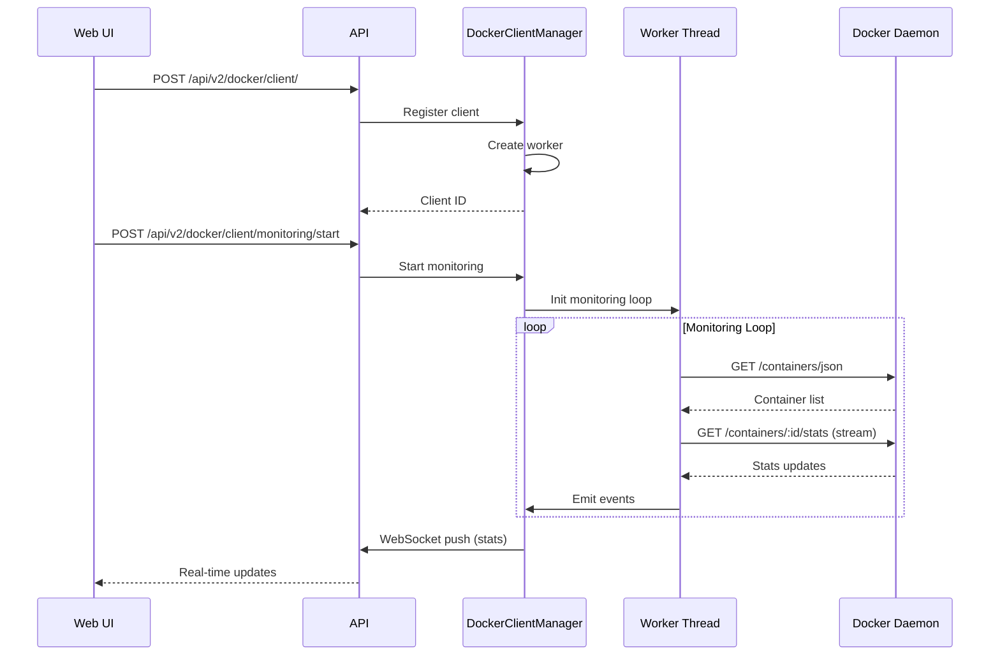

## Technology Stack

### Runtime & Framework

| Technology | Purpose | Version |
|------------|---------|---------|
| **Bun** | JavaScript runtime | Latest |
| **Elysia** | Web framework | Latest |
| **TypeScript** | Type safety | Latest |

### Core Dependencies

| Package | Purpose |
|---------|---------|
| `@elysiajs/cors` | CORS handling |
| `@elysiajs/eden` | Type-safe client generation |
| `@elysiajs/openapi` | API documentation |
| `@elysiajs/server-timing` | Performance monitoring |
| `@dockstat/db` | Database abstraction |
| `@dockstat/docker-client` | Docker operations |
| `@dockstat/plugin-handler` | Plugin system |
| `@dockstat/logger` | Logging utility |
| `@dockstat/sqlite-wrapper` | Database query builder |
| `@dockstat/typings` | Shared types |

### Utilities

| Package | Purpose |
|---------|---------|
| `dagre` | Graph layout algorithms |
| `@types/dagre` | TypeScript definitions |

## Key Architectural Patterns

### 1. Layered Architecture

Clear separation between:
- **Presentation Layer**: Routes and validation
- **Business Logic Layer**: Core services (DCM, PluginHandler)
- **Data Layer**: Database and external integrations
- **Infrastructure Layer**: Middleware, logging, metrics

### 2. Plugin Architecture

Extensible system allowing:
- Custom route registration
- Event hook registration
- Database table creation
- Dynamic code loading

### 3. Event-Driven Monitoring

Real-time updates through:
- WebSocket connections
- Event emitters
- Streaming responses

### 4. Type Safety

End-to-end type safety with:
- TypeScript for all code
- Typebox schemas for validation
- Eden for client type generation
- Shared types package

### 5. Middleware Pipeline

Ordered processing of requests:
- Pre-processing (CORS, timing)
- Logging and metrics
- Validation
- Route handling
- Error handling

## Scalability Considerations

### Horizontal Scaling

The API is designed for horizontal scaling through:

1. **Stateless Operations**
   - Authentication state not yet implemented
   - Session management via tokens (future)
   - WebSocket affinity requirements

2. **Worker Pool Architecture**
   - DockerClientManager uses worker threads
   - Configurable worker limits
   - Parallel operation support

3. **Database Design**
   - SQLite for single-instance deployments
   - Can be migrated to PostgreSQL for distributed systems
   - Connection pooling support

### Performance Optimizations

1. **Precompilation**
   - Elysia routes precompiled
   - Faster request handling
   - Reduced startup time

2. **Streaming Responses**
   - Container statistics streamed
   - Real-time log streaming
   - Efficient memory usage

3. **Caching**
   - OpenAPI documentation cached
   - Database query caching (via SQLite wrapper)
   - Plugin code caching

## Security Architecture

### Current State

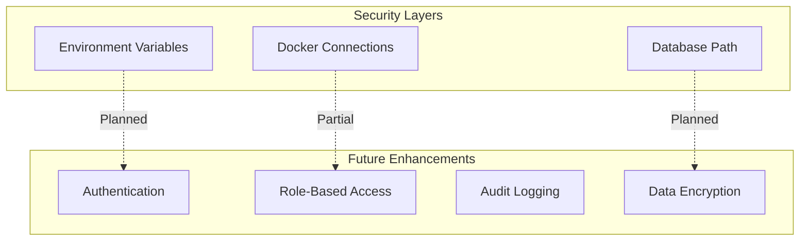

### Security Considerations

1. **Input Validation**
   - Typebox schemas on all routes
   - Request body validation
   - Parameter sanitization

2. **Error Handling**
   - No sensitive data in error messages
   - Detailed errors in development only
   - Structured error responses

3. **Docker Socket Access**
   - Requires proper file permissions
   - TCP connection support with TLS
   - Connection configuration in database

4. **Future Enhancements**
   - JWT authentication
   - Rate limiting
   - Request signing
   - HTTPS enforcement
   - SQL injection prevention

## Configuration Management

### Environment Variables

| Variable | Description | Default |
|----------|-------------|---------|
| `DOCKSTATAPI_PORT` | API server port | `3030` |
| `DOCKSTATAPI_SHOW_TRACES` | Enable server timing | `true` |
| `DOCKSTAT_MAX_WORKERS` | Max Docker workers | `200` |
| `DOCKSTAT_LOGGER_FULL_FILE_PATH` | Full log paths | `false` |

### Database Configuration

- **Path**: Automatically managed by `@dockstat/db`
- **Initialization**: Automatic schema creation
- **Migrations**: Manual migration support
- **Backups**: Built-in backup functionality

## Deployment Architecture

### Single-Instance Deployment

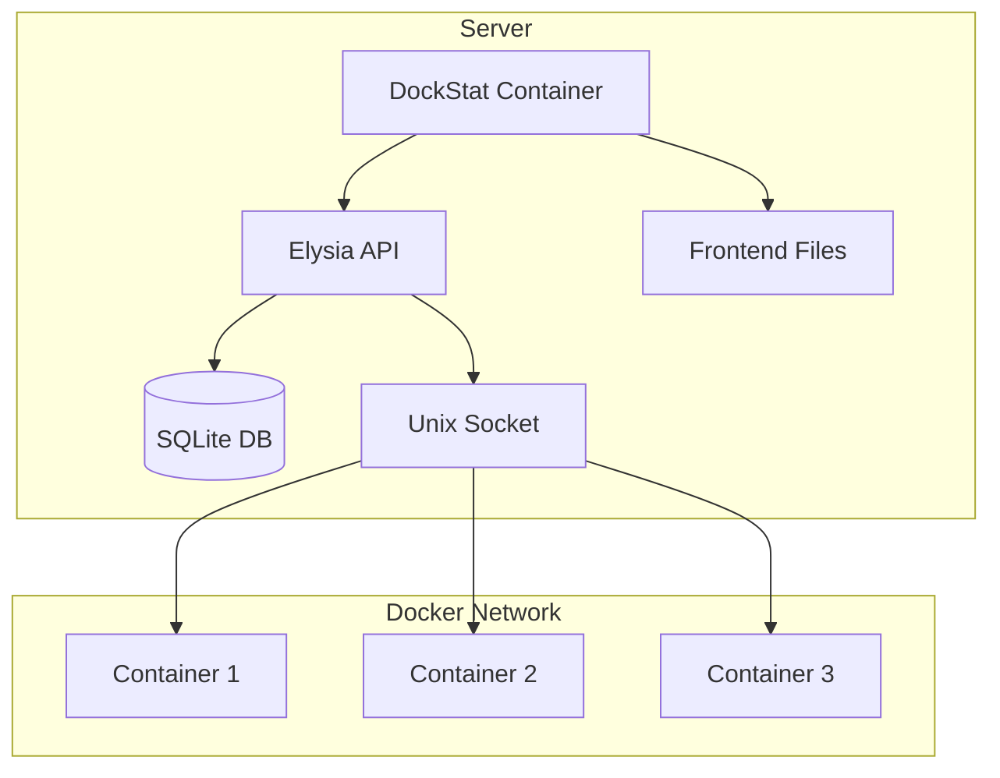

### Distributed Deployment (Future)

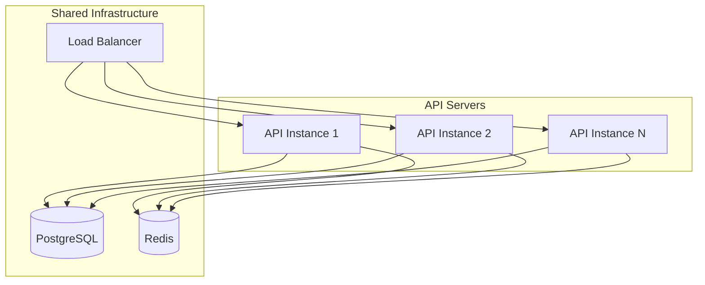

## Extension Points

The API provides several extension points for customization:

1. **Custom Routes**
   - Plugin system allows adding new endpoints
   - Middleware injection points
   - WebSocket extensions

2. **Event Hooks**
   - Container lifecycle events
   - Plugin lifecycle events
   - Database operations
   - Request/response processing

3. **Custom Services**
   - Additional core services
   - External API integrations
   - Background job processing

4. **Database Extensions**
   - Custom table creation via plugins
   - Migration system
   - Query hooks

## Monitoring and Observability

### Built-in Metrics

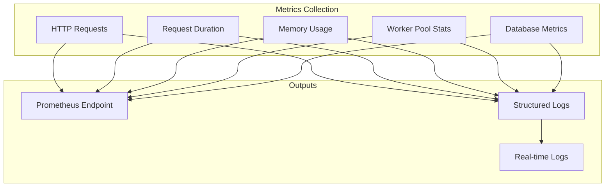

### Available Metrics

1. **HTTP Metrics**
   - Request count by method and route
   - Request duration histograms
   - Response status codes

2. **Database Metrics**
   - Query execution time
   - Database size
   - Table row counts

3. **Docker Metrics**
   - Worker pool statistics
   - Active streams
   - Memory usage per worker

4. **System Metrics**
   - API server uptime
   - Memory usage
   - Active connections

## Next Steps

- [ ] Implement authentication middleware
- [ ] Add rate limiting
- [ ] Enhance error monitoring
- [ ] Implement distributed tracing
- [ ] Add comprehensive unit tests
- [ ] Performance benchmarking
- [ ] Security audit
- [ ] API versioning strategy

## Related Documentation

- [API Development Guide](../api-development/README.md)
- [API Patterns](../api-patterns/README.md)
- [WebSocket Documentation](../api-websockets/README.md)
- [Plugin System](../api-plugins/README.md)
- [API Reference](../api-reference/README.md)