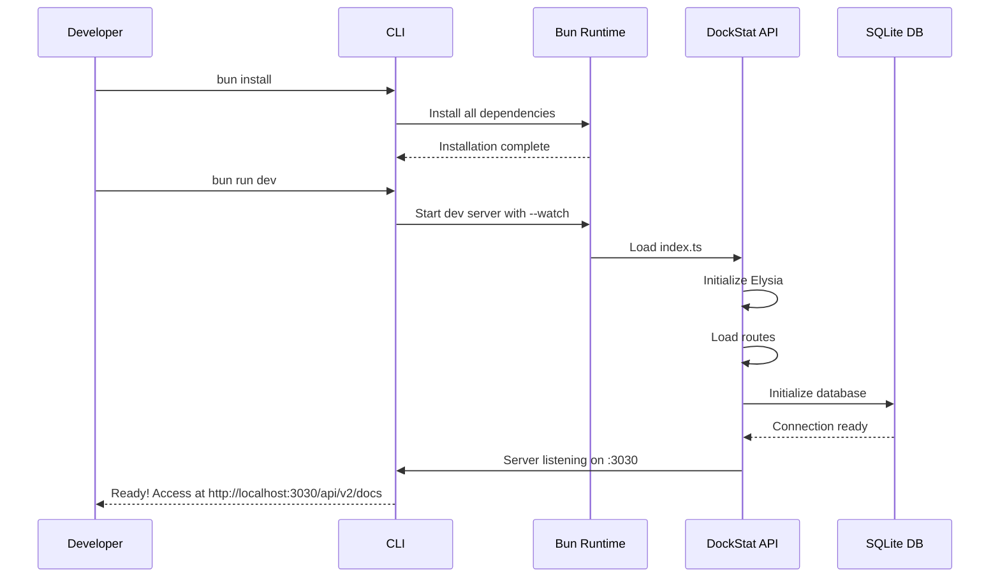
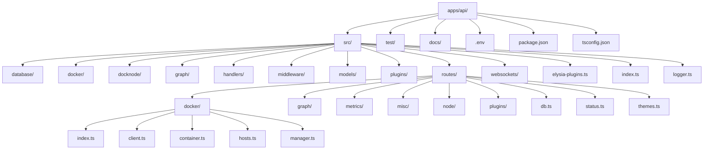
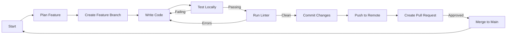
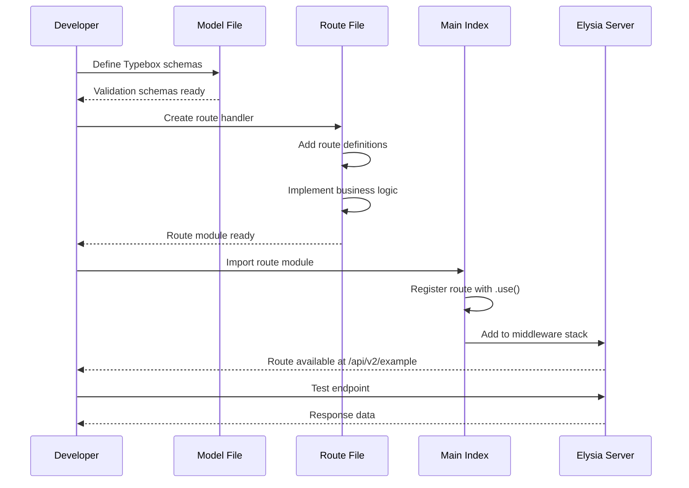
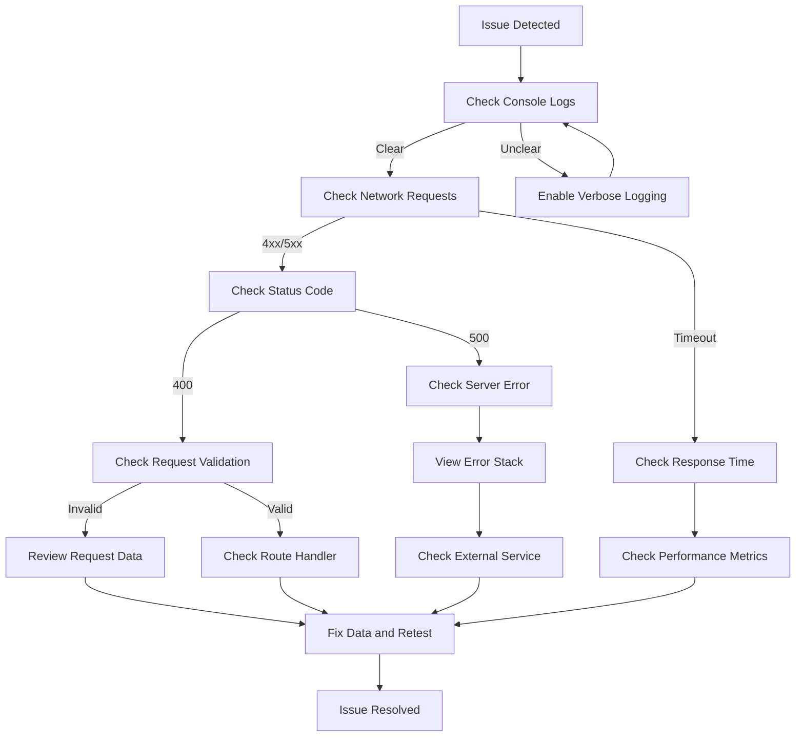
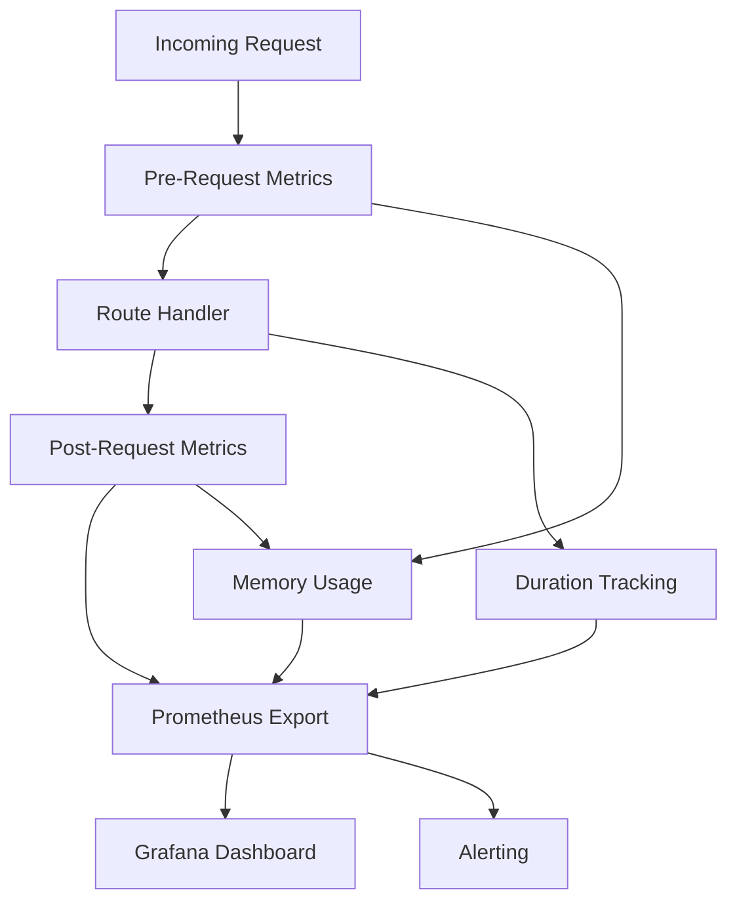

> This guide provides comprehensive instructions for developing the DockStat API, covering setup, workflow, patterns, and best practices.

## Table of Contents

- [Prerequisites](#prerequisites)
- [Environment Setup](#environment-setup)
- [Project Structure](#project-structure)
- [Development Workflow](#development-workflow)
- [Adding New Features](#adding-new-features)
- [Testing](#testing)
- [Debugging](#debugging)
- [Best Practices](#best-practices)
- [Common Tasks](#common-tasks)

## Prerequisites

### Required Software

| Tool | Version | Purpose |
|------|---------|---------|
| **Bun** | >= 1.0 | JavaScript runtime |
| **Git** | >= 2.30 | Version control |
| **Docker** | >= 20.10 | Container testing |
| **Docker Compose** | >= 2.0 | Multi-container testing |
| **VS Code** (recommended) | Latest | IDE with TypeScript support |

### Optional Tools

| Tool | Purpose |
|------|---------|
| **Postman** / **Bruno** | API testing |
| **DBeaver** | SQLite database viewer |
| **Mermaid Live Editor** | Diagram visualization |

## Environment Setup

### 1. Clone the Repository

```bash
git clone https://github.com/Its4Nik/DockStat.git
cd DockStat
```

### 2. Install Dependencies

```bash
bun install
```

This installs dependencies for the entire monorepo using workspaces.

### 3. Configure Environment Variables

Create a `.env` file in `apps/api/`:

```bash
# API Configuration
DOCKSTATAPI_PORT=3030
DOCKSTATAPI_SHOW_TRACES=true

# Docker Client Manager
DOCKSTAT_MAX_WORKERS=200

# Logger Configuration
DOCKSTAT_LOGGER_FULL_FILE_PATH=false
DOCKSTAT_LOGGER_DISABLED_LOGGERS=
DOCKSTAT_LOGGER_ONLY_SHOW=
```

### 4. Initialize the Database

The database is automatically initialized on first run, but you can verify it:

```bash
cd apps/api
bun run -e "import { DockStatDB } from './src/database'; console.log('DB Path:', DockStatDB._dbPath)"
```

### 5. Verify Setup

```bash
bun run dev
```

You should see the DockStat banner and the API should be running on port 3030.



## Project Structure

### Directory Organization



### File Purpose Overview

| File/Directory | Purpose |
|----------------|---------|
| `src/index.ts` | Main entry point, Elysia app initialization |
| `src/elysia-plugins.ts` | Global Elysia plugins (CORS, OpenAPI, timing) |
| `src/logger.ts` | Logger configuration with WebSocket forwarding |
| `src/routes/` | HTTP route definitions organized by domain |
| `src/models/` | Typebox schemas for request/response validation |
| `src/handlers/` | Request handlers and middleware |
| `src/middleware/` | Custom middleware components |
| `src/database/` | Database initialization and utilities |
| `src/websockets/` | WebSocket endpoint definitions |
| `src/plugins/` | Plugin handler initialization |
| `src/docker/` | DockerClientManager singleton export |
| `src/docknode/` | DockNode integration |
| `src/graph/` | Graph-related utilities |

## Development Workflow

### Daily Development Cycle



### 1. Start Development Server

```bash
cd apps/api
bun run dev
```

The server runs in watch mode and automatically reloads on file changes.

### 2. Access Documentation

- **API Docs**: http://localhost:3030/api/v2/docs
- **OpenAPI Spec**: http://localhost:3030/api/v2/swagger/json
- **Health Check**: http://localhost:3030/api/v2/status/health

### 3. Make Changes

Edit TypeScript files in `src/`. The server will automatically reload.

### 4. Test Changes

Use the API documentation page or tools like Postman/Bruno to test your endpoints.

### 5. View Logs

Logs are printed to the console. For real-time log streaming, connect to the WebSocket:

```javascript
const ws = new WebSocket('ws://localhost:3030/ws/logs');
ws.onmessage = (event) => {
  console.log(JSON.parse(event.data));
};
```

## Adding New Features

### Adding a New Route

#### Step 1: Define the Schema (Model)

Create or update a model file in `src/models/`:

```typescript
// src/models/example.ts
import { t } from "elysia"

export namespace ExampleModel {
  // Request body schema
  export const createBody = t.Object({
    name: t.String({ minLength: 1, maxLength: 100 }),
    description: t.Optional(t.String()),
    enabled: t.Optional(t.Boolean({ default: false })),
  })

  // Response schema for success
  export const response = t.Object({
    success: t.Literal(true),
    id: t.Number(),
    message: t.String(),
  })

  // Error schema
  export const error = t.Object({
    success: t.Literal(false),
    error: t.String(),
    message: t.String(),
  })
}
```

#### Step 2: Create the Route Handler

Create a new route file in `src/routes/`:

```typescript
// src/routes/example.ts
import { extractErrorMessage } from "@dockstat/utils"
import Elysia, { t } from "elysia"
import { ExampleModel } from "../models/example"

const ExampleRoutes = new Elysia({
  prefix: "/example",
  detail: {
    tags: ["Example"],
    summary: "Example endpoint group",
    description: "Demonstrates how to create new routes",
  },
})
  .get("/", () => {
    return {
      success: true,
      message: "Example route is working",
    }
  })
  .post(
    "/",
    async ({ body, status }) => {
      try {
        // Your business logic here
        const id = Date.now()
        
        return status(201, {
          success: true,
          id,
          message: "Resource created successfully",
        })
      } catch (error) {
        const errorMessage = extractErrorMessage(
          error, 
          "Failed to create resource"
        )
        return status(500, {
          success: false,
          error: errorMessage,
          message: errorMessage,
        })
      }
    },
    {
      body: ExampleModel.createBody,
      response: {
        201: ExampleModel.response,
        500: ExampleModel.error,
      },
    }
  )

export default ExampleRoutes
```

#### Step 3: Register the Route

Add the route to the main app in `src/index.ts`:

```typescript
import ExampleRoutes from "./routes/example"

export const DockStatAPI = new Elysia({ prefix: "/api/v2" })
  // ... existing middleware
  .use(StatusRoutes)
  .use(DBRoutes)
  .use(DockerRoutes)
  .use(ExampleRoutes) // Add your new route here
  .listen(PORT)
```

#### Route Development Flow



### Adding New Middleware

#### Example: Custom Authentication Middleware

```typescript
// src/middleware/auth.ts
import Elysia, { t } from "elysia"

export const authMiddleware = new Elysia()
  .derive(async ({ headers, set }) => {
    const authHeader = headers["authorization"]
    
    if (!authHeader) {
      set.status = 401
      throw new Error("Authorization header required")
    }
    
    // Validate token (implement your logic)
    const isValid = await validateToken(authHeader)
    
    if (!isValid) {
      set.status = 403
      throw new Error("Invalid authorization token")
    }
    
    // Add user info to context
    return {
      user: {
        id: "123",
        role: "admin",
      },
    }
  })

// Usage in routes
import { authMiddleware } from "../middleware/auth"

const ProtectedRoutes = new Elysia()
  .use(authMiddleware)
  .get("/protected", ({ user }) => {
    return { message: "Protected data", userId: user.id }
  })
```

### Adding New Database Tables

#### Step 1: Define Types

```typescript
// In packages/typings/src/types.ts or local types
export interface ExampleTable {
  id: number
  name: string
  description: string | null
  enabled: boolean
  created_at: string
  updated_at: string
}
```

#### Step 2: Create Migration

```typescript
// src/database/migrations/create_example_table.ts
import { DockStatDB } from "../index"

export async function up() {
  await DockStatDB._sqliteWrapper.exec(`
    CREATE TABLE IF NOT EXISTS example (
      id INTEGER PRIMARY KEY AUTOINCREMENT,
      name TEXT NOT NULL,
      description TEXT,
      enabled BOOLEAN DEFAULT 0,
      created_at DATETIME DEFAULT CURRENT_TIMESTAMP,
      updated_at DATETIME DEFAULT CURRENT_TIMESTAMP
    );
  `)
}

export async function down() {
  await DockStatDB._sqliteWrapper.exec(`
    DROP TABLE IF EXISTS example;
  `)
}
```

#### Step 3: Access Table in Routes

```typescript
import { DockStatDB } from "../database"

// In a route handler
const results = DockStatDB._sqliteWrapper
  .table("example")
  .select(["*"])
  .all()
```

## Testing

### Manual Testing

1. **Using OpenAPI Docs**
   - Navigate to http://localhost:3030/api/v2/docs
   - Click on an endpoint
   - Fill in parameters
   - Execute the request

2. **Using cURL**

```bash
# Example GET request
curl http://localhost:3030/api/v2/status

# Example POST request
curl -X POST http://localhost:3030/api/v2/docker/client \
  -H "Content-Type: application/json" \
  -d '{"clientName": "test", "options": null}'
```

3. **Using Bun**

```bash
bun run -e "
const response = await fetch('http://localhost:3030/api/v2/status');
const data = await response.json();
console.log(data);
"
```

### Automated Testing (Planned)

```bash
# Run all tests
bun test

# Run with coverage
bun test --coverage

# Run specific test file
bun test test/routes/docker.test.ts
```

### Integration Testing

Test the full integration with Docker:

```bash
# Start a test Docker container
docker run -d --name test-nginx nginx:alpine

# Test API connection
curl http://localhost:3030/api/v2/docker/hosts/add \
  -H "Content-Type: application/json" \
  -d '{
    "clientId": 1,
    "hostname": "localhost",
    "name": "Test Host",
    "secure": false,
    "port": 2375
  }'

# Verify container detection
curl http://localhost:3030/api/v2/docker/containers/all/1

# Cleanup
docker stop test-nginx
docker rm test-nginx
```

## Debugging

### Common Debugging Techniques

#### 1. Enable Verbose Logging

```bash
DOCKSTAT_LOGGER_FULL_FILE_PATH=true DOCKSTAT_LOGGER_ONLY_SHOW=DockStatAPI bun run dev
```

#### 2. Use TypeScript Type Checking

```bash
bun run tsc --noEmit
```

#### 3. Inspect Request/Response

Add to your route:

```typescript
.get("/debug", ({ request, body, headers }) => {
  console.log("Request:", {
    method: request.method,
    url: request.url,
    headers: Object.fromEntries(headers),
    body,
  })
  return { received: true }
})
```

#### 4. Database Inspection

```bash
# Connect to SQLite database
sqlite3 apps/api/dockstat.sqlite

# List tables
.tables

# Query data
SELECT * FROM docker_clients;
```

#### 5. WebSocket Debugging

```javascript
// In browser console
const ws = new WebSocket('ws://localhost:3030/ws/logs');
ws.onopen = () => console.log('Connected');
ws.onmessage = (e) => console.log('Log:', JSON.parse(e.data));
ws.onerror = (e) => console.error('Error:', e);
```

### Debugging Flow



### Common Issues and Solutions

| Issue | Symptoms | Solution |
|-------|----------|----------|
| **Port already in use** | "Error: listen EADDRINUSE" | Change `DOCKSTATAPI_PORT` or kill the process using the port |
| **Database locked** | "database is locked" errors | Check for other processes accessing the DB, use transaction properly |
| **Type errors** | TypeScript compilation fails | Run `bun run tsc --noEmit` to see all errors, fix types |
| **Validation fails** | 400 Bad Request | Check request body against Typebox schema, verify Content-Type header |
| **CORS errors** | Browser shows CORS error | Check `@elysiajs/cors` configuration in `elysia-plugins.ts` |
| **Worker crashes** | Docker monitoring stops | Check Docker daemon connection, verify worker count settings |

## Best Practices

### Code Organization

1. **Keep routes focused** - Each route file should handle a single domain
2. **Separate concerns** - Models in `models/`, routes in `routes/`, business logic in services
3. **Use namespaces** - Group related schemas in model files using TypeScript namespaces
4. **Export default** - Export route modules as default for easier imports

### Error Handling

```typescript
// Always wrap in try-catch for external operations
.post("/create", async ({ body, status }) => {
  try {
    const result = await someExternalService(body)
    return status(200, { success: true, data: result })
  } catch (error) {
    const errorMessage = extractErrorMessage(
      error, 
      "Descriptive error message"
    )
    return status(500, {
      success: false,
      error: errorMessage,
      message: errorMessage,
    })
  }
})
```

### Validation

```typescript
// Always define schemas for request/response
.post("/endpoint", handler, {
  body: t.Object({
    // required fields
    name: t.String(),
    // optional fields
    description: t.Optional(t.String()),
  }),
  query: t.Object({
    page: t.Optional(t.Number({ minimum: 1 })),
    limit: t.Optional(t.Number({ minimum: 1, maximum: 100 })),
  }),
  response: {
    200: t.Object({ success: t.Boolean() }),
    400: t.Object({ error: t.String() }),
  },
})
```

### Database Operations

```typescript
// Use transactions for multiple operations
import DockStatDB from "../database"

try {
  await DockStatDB._sqliteWrapper.transaction(async () => {
    DockStatDB._sqliteWrapper
      .table("example")
      .insert({ name: "test" })
    
    DockStatDB._sqliteWrapper
      .table("logs")
      .insert({ message: "Created test" })
  })
} catch (error) {
  console.error("Transaction failed:", error)
}
```

### Logging

```typescript
import BaseLogger from "../logger"

const routeLogger = BaseLogger.spawn("RouteName")

routeLogger.info("Processing request")
routeLogger.debug("Details", { data })
routeLogger.warn("Warning condition")
routeLogger.error("Error occurred", { error })
```

## Common Tasks

### Adding a New Docker Operation

1. Add method to `@dockstat/docker-client` package
2. Import DockerClientManager in your route
3. Call the method with appropriate parameters
4. Handle errors gracefully

### Adding WebSocket Support

```typescript
// src/websockets/customSocket.ts
import Elysia, { t } from "elysia"

const clients = new Set()

export const CustomSocket = new Elysia().ws("/ws/custom", {
  response: t.Object({
    type: t.String(),
    data: t.Any(),
  }),
  
  open(ws) {
    clients.add(ws)
    ws.send({ type: "connected", data: "Welcome!" })
  },
  
  message(ws, message) {
    // Handle incoming message
    console.log("Received:", message)
    
    // Broadcast to all clients
    for (const client of clients) {
      client.send({ type: "broadcast", data: message })
    }
  },
  
  close(ws) {
    clients.delete(ws)
  },
})

// Register in src/index.ts
import { CustomSocket } from "./websockets/customSocket"

export const DockStatAPI = new Elysia()
  .use(CustomSocket)
```

### Creating a Plugin Route

```typescript
// src/routes/plugins/custom.ts
import Elysia, { t } from "elysia"
import PluginHandler from "../plugins"

export const CustomPluginRoutes = new Elysia({
  prefix: "/plugins/custom",
  detail: {
    tags: ["Plugins", "Custom"],
  },
})
  .get("/list", () => {
    const plugins = PluginHandler.getAll()
    return {
      total: plugins.length,
      plugins: plugins.filter(p => p.type === "custom"),
    }
  })
  .post("/execute", ({ body }) => {
    // Execute plugin action
    return { success: true }
  }, {
    body: t.Object({
      pluginId: t.Number(),
      action: t.String(),
      params: t.Optional(t.Object({})),
    })
  })
```

### Updating OpenAPI Documentation

```typescript
// Add metadata to routes
const MyRoutes = new Elysia({
  prefix: "/my-endpoint",
  detail: {
    tags: ["My Domain"],
    summary: "Brief summary",
    description: "Detailed description with examples",
    security: [{ BearerAuth: [] }], // If using auth
  },
})

// Add detailed examples to schemas
const schema = t.Object({
  name: t.String({
    examples: ["Example Name"],
    description: "The name of the resource",
  }),
  age: t.Number({
    examples: [25],
    minimum: 0,
    maximum: 150,
  }),
})
```

### Performance Monitoring



Use server timing to measure performance:

```typescript
// Check response headers for timing info
// Server-Timing: total;dur=45, handle;dur=40, database;dur=30
```

## Contributing

### Code Review Checklist

Before submitting a PR, verify:

- [ ] Code follows existing patterns and conventions
- [ ] All TypeScript type errors are resolved
- [ ] New routes include proper error handling
- [ ] Request/response schemas are defined
- [ ] OpenAPI documentation is accurate
- [ ] Database operations use transactions where appropriate
- [ ] Logs are appropriate and informative
- [ ] No sensitive data in logs or error messages
- [ ] Tests (if applicable) pass

### Git Commit Messages

Follow conventional commits:

```
feat(api): add new Docker health check endpoint
fix(routes): resolve validation error in container list
docs(api): update architecture documentation
refactor(models): simplify typebox schema definitions
chore(deps): update elysia to latest version
```

### Pull Request Template

```markdown
## Description
Brief description of changes

## Type of Change
- [ ] Bug fix
- [ ] New feature
- [ ] Breaking change
- [ ] Documentation update

## Testing
Describe how this was tested

## Screenshots (if applicable)

## Checklist
- [ ] Code follows style guidelines
- [ ] Self-review completed
- [ ] Documentation updated
- [ ] No new warnings
```

## Related Documentation

- [API Architecture Overview](../api-architecture/README.md)
- [API Patterns](../api-patterns/README.md)
- [WebSocket Documentation](../api-websockets/README.md)
- [Plugin System](../api-plugins/README.md)
- [API Reference](../api-reference/README.md)

## Getting Help

- **GitHub Issues**: https://github.com/Its4Nik/DockStat/issues
- **Documentation**: https://dockstat.itsnik.de
- **Discord**: [Join our Discord](#)