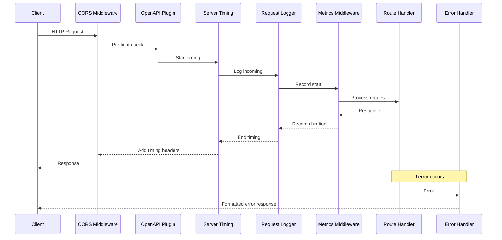
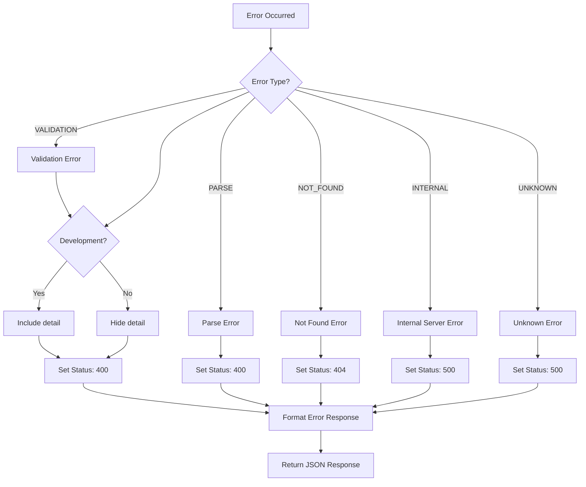
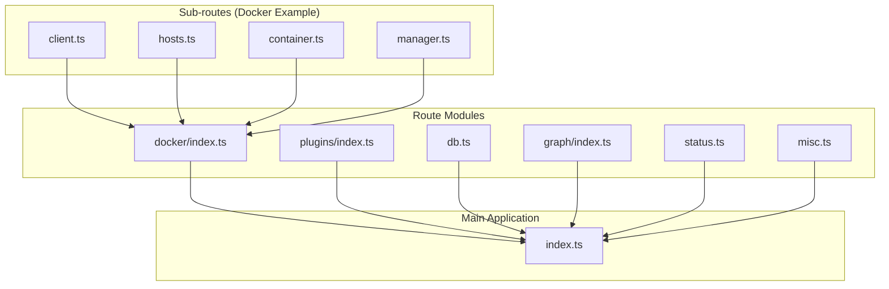
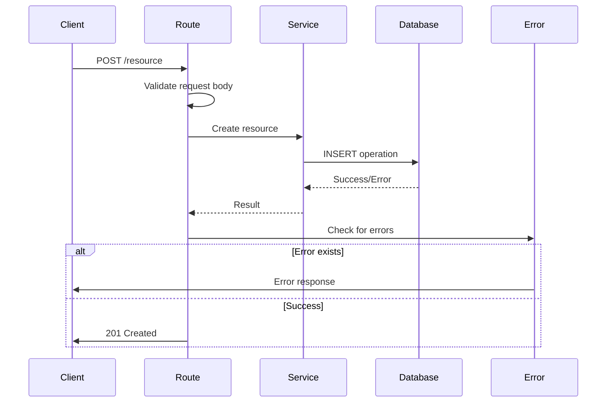
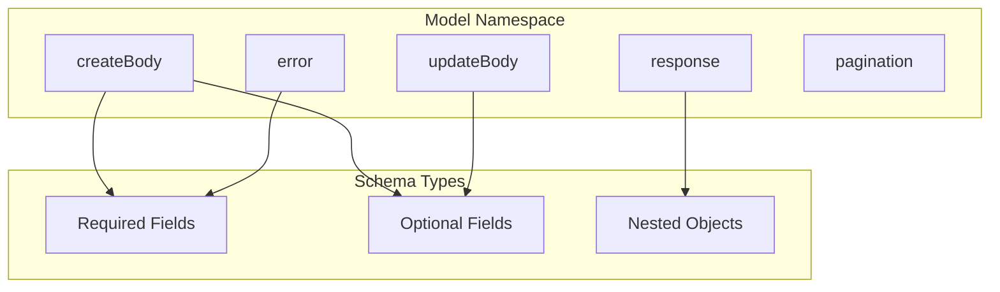
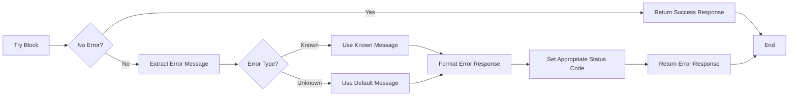
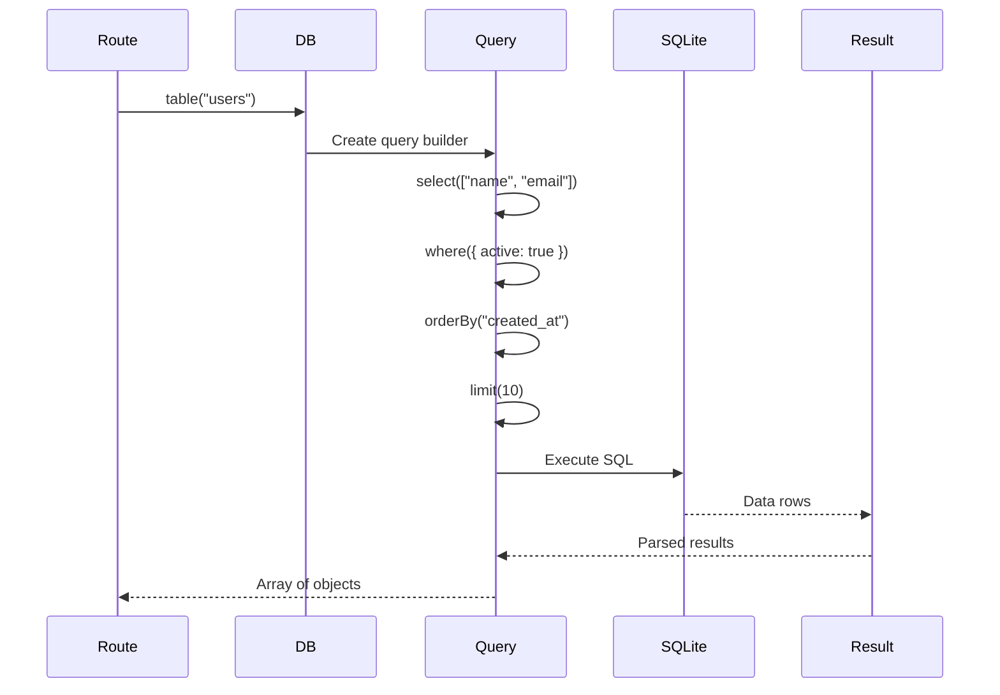
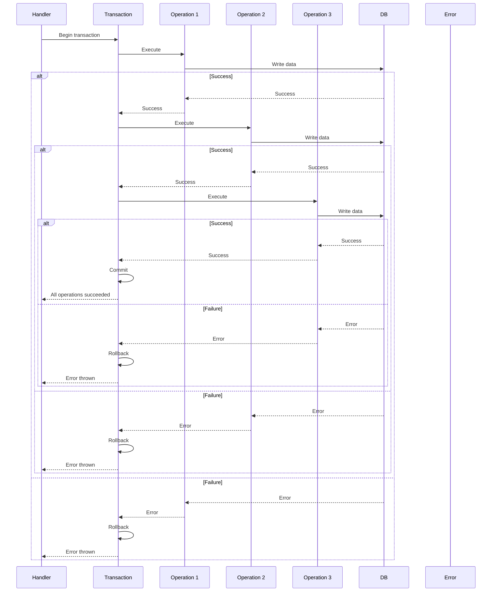
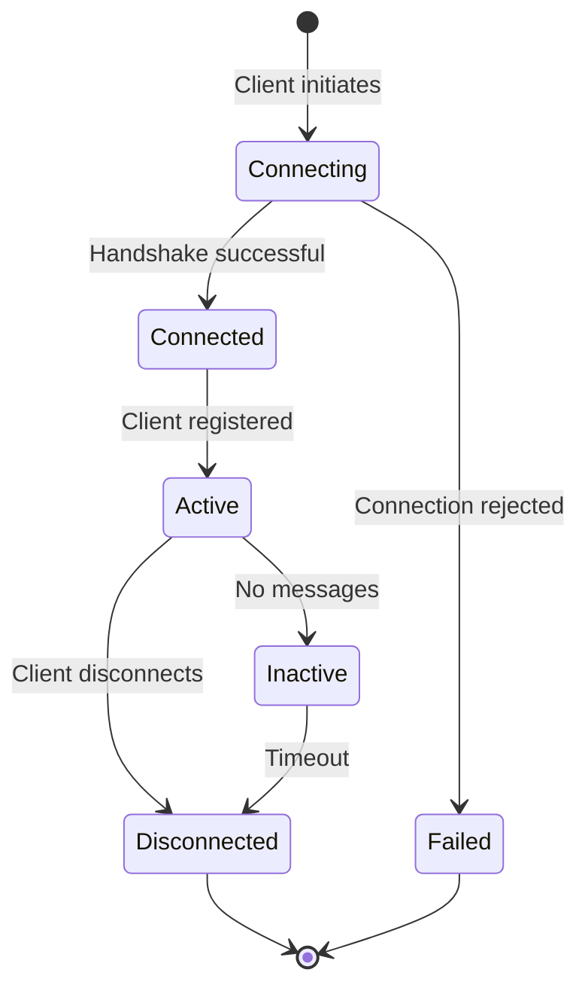
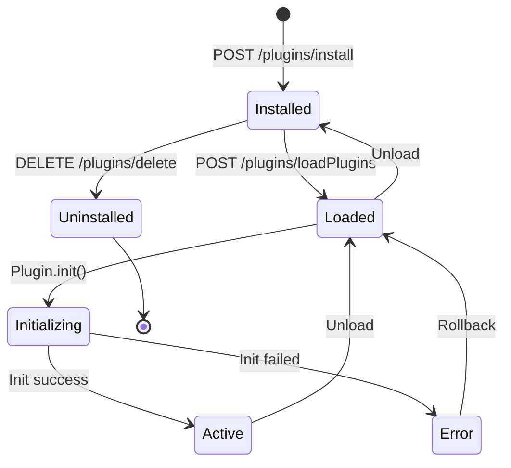

> This document describes the architectural and implementation patterns used throughout the DockStat API, serving as a guide for consistent and maintainable code development.

## Table of Contents

- [Middleware Patterns](#middleware-patterns)
- [Route Organization Patterns](#route-organization-patterns)
- [Handler Patterns](#handler-patterns)
- [Model and Validation Patterns](#model-and-validation-patterns)
- [Error Handling Patterns](#error-handling-patterns)
- [Database Interaction Patterns](#database-interaction-patterns)
- [WebSocket Patterns](#websocket-patterns)
- [Plugin Patterns](#plugin-patterns)
- [Service Layer Patterns](#service-layer-patterns)

## Middleware Patterns

### Global Middleware Pipeline

The API uses a layered middleware pattern where each middleware processes requests in sequence.



### Middleware Implementation Pattern

```typescript
// Pattern: Decorator-style middleware with derivation
import Elysia, { t } from "elysia"

export const exampleMiddleware = new Elysia({ name: "ExampleMiddleware" })
  .derive(async ({ request, set }) => {
    // Pre-processing
    const startTime = Date.now()
    
    // Return derived context
    return {
      customData: "derived value",
      logRequest: () => {
        console.log(`${request.method} ${request.url} took ${Date.now() - startTime}ms`)
      }
    }
  })
  .onAfterHandle(({ logRequest }) => {
    // Post-processing
    logRequest?.()
  })
```

### Global Error Handler Pattern

The error handler provides centralized error processing with differentiated responses based on error type.



**Implementation:**

```typescript
export const errorHandler = new Elysia().onError(({ code, error, set, request }) => {
  const path = new URL(request.url).pathname
  const timestamp = new Date().toISOString()

  if (code === "VALIDATION") {
    const validationError = error as ValidationError
    
    if (validationError.type === "response") {
      set.status = 500
      return {
        success: false,
        error: "Response validation failed",
        message: validationError.message,
        path,
        timestamp,
        ...(process.env.NODE_ENV === "development" && { detail: validationError.all }),
      }
    }

    set.status = 400
    return {
      success: false,
      error: "Validation failed",
      message: validationError.message,
      path,
      timestamp,
      ...(process.env.NODE_ENV === "development" && { detail: validationError.all }),
    }
  }

  // Handle other error types...
  set.status = 500
  return {
    success: false,
    error: "Internal server error",
    message: extractErrorMessage(error, "An unexpected error occurred"),
    path,
    timestamp,
  }
})
```

### Metrics Middleware Pattern

```typescript
// Pattern: Request tracking with Prometheus-style metrics
const MetricsMiddleware = new Elysia({ name: "MetricsMiddleware" })
  .derive(async ({ request }) => {
    return {
      startTime: Date.now(),
      method: request.method,
      path: new URL(request.url).pathname,
    }
  })
  .onAfterHandle(({ startTime, method, path, set }) => {
    const duration = Date.now() - startTime
    
    // Record metrics
    metricsRegistry.counter('http_requests_total').inc({
      method,
      path,
      status: set.status,
    })
    
    metricsRegistry.histogram('http_request_duration_seconds').observe(
      { method, path },
      duration / 1000
    )
  })
```

## Route Organization Patterns

### Modular Route Pattern

Routes are organized by domain, each module exposing a default Elysia instance.



**Implementation:**

```typescript
// Pattern: Aggregator route module
import Elysia from "elysia"
import { DockerClientElysia } from "./client"
import { DockerHostElysia } from "./hosts"
import { DockerContainerElysia } from "./container"
import { DockerManager } from "./manager"

const DockerRoutes = new Elysia({
  prefix: "/docker",
  detail: {
    tags: ["Docker"],
    description: "Docker client and container management endpoints",
  },
})
  .use(DockerManager)
  .use(DockerClientElysia)
  .use(DockerHostElysia)
  .use(DockerContainerElysia)

export default DockerRoutes
```

### Prefix and Tagging Pattern

```typescript
// Pattern: Consistent prefix and tagging for documentation
const MyRoutes = new Elysia({
  prefix: "/my-domain",           // URL prefix for all routes
  detail: {
    tags: ["My Domain"],          // OpenAPI tag grouping
    description: "Description of this route group",
  },
})
```

## Handler Patterns

### CRUD Handler Pattern

Standard CRUD operations follow a consistent pattern.



**Implementation:**

```typescript
// Pattern: Create handler with validation and error handling
.post(
  "/",
  async ({ body, status }) => {
    try {
      const result = await service.create(body)
      return status(201, {
        success: true,
        data: result,
        message: "Resource created successfully",
      })
    } catch (error) {
      const errorMessage = extractErrorMessage(error, "Failed to create resource")
      return status(400, {
        success: false,
        error: errorMessage,
        message: errorMessage,
      })
    }
  },
  {
    body: ResourceModel.createBody,
    response: {
      201: ResourceModel.successResponse,
      400: ResourceModel.error,
    },
  }
)
```

### List Handler with Pagination Pattern

```typescript
// Pattern: Paginated list handler
.get(
  "/",
  async ({ query, status }) => {
    try {
      const page = query.page || 1
      const limit = Math.min(query.limit || 50, 100)
      const offset = (page - 1) * limit
      
      const items = await service.list({
        limit,
        offset,
        filter: query.filter,
        sort: query.sort,
      })
      
      return status(200, {
        success: true,
        data: items,
        pagination: {
          page,
          limit,
          total: items.total,
          pages: Math.ceil(items.total / limit),
        },
      })
    } catch (error) {
      const errorMessage = extractErrorMessage(error, "Failed to fetch resources")
      return status(500, {
        success: false,
        error: errorMessage,
        message: errorMessage,
      })
    }
  },
  {
    query: t.Object({
      page: t.Optional(t.Number({ minimum: 1 })),
      limit: t.Optional(t.Number({ minimum: 1, maximum: 100 })),
      filter: t.Optional(t.String()),
      sort: t.Optional(t.String()),
    }),
  }
)
```

### Toggle Handler Pattern

```typescript
// Pattern: Binary state toggle handler
.post(
  "/:id/toggle",
  async ({ params, status }) => {
    try {
      const currentState = await service.getState(params.id)
      const newState = !currentState
      
      await service.setState(params.id, newState)
      
      return status(200, {
        success: true,
        message: newState ? "Enabled" : "Disabled",
        state: newState,
      })
    } catch (error) {
      const errorMessage = extractErrorMessage(error, "Failed to toggle state")
      return status(500, {
        success: false,
        error: errorMessage,
        message: errorMessage,
      })
    }
  },
  {
    params: t.Object({ id: t.Number() }),
  }
)
```

## Model and Validation Patterns

### Namespace Pattern for Models

Models use TypeScript namespaces to group related schemas.



**Implementation:**

```typescript
// Pattern: Namespace-based model organization
import { t } from "elysia"

export namespace ResourceModel {
  // Request schemas
  export const createBody = t.Object({
    name: t.String({ minLength: 1, maxLength: 100 }),
    description: t.Optional(t.String({ maxLength: 500 })),
    enabled: t.Optional(t.Boolean({ default: false })),
    metadata: t.Optional(t.Record(t.String(), t.Any())),
  })

  export const updateBody = t.Partial(t.Omit(createBody, ["id"]))

  export const queryFilters = t.Object({
    page: t.Optional(t.Number({ minimum: 1, default: 1 })),
    limit: t.Optional(t.Number({ minimum: 1, maximum: 100, default: 50 })),
    search: t.Optional(t.String()),
    sort: t.Optional(t.String()),
    order: t.Optional(t.UnionEnum(["asc", "desc"])),
  })

  // Response schemas
  export const resource = t.Object({
    id: t.Number(),
    name: t.String(),
    description: t.Nullable(t.String()),
    enabled: t.Boolean(),
    metadata: t.Nullable(t.Record(t.String(), t.Any())),
    created_at: t.Date(),
    updated_at: t.Date(),
  })

  export const resourceList = t.Array(resource)

  export const paginatedResponse = t.Object({
    success: t.Literal(true),
    data: resourceList,
    pagination: t.Object({
      page: t.Number(),
      limit: t.Number(),
      total: t.Number(),
      pages: t.Number(),
    }),
  })

  // Error schemas
  export const error = t.Object({
    success: t.Literal(false),
    error: t.String(),
    message: t.String(),
  })

  export const notFoundError = t.Object({
    success: t.Literal(false),
    error: t.Literal("Not found"),
    message: t.String(),
  })

  // Combined response types
  export const createResponse = t.Object({
    success: t.Literal(true),
    data: resource,
    message: t.String(),
  })

  export const updateResponse = t.Object({
    success: t.Literal(true),
    data: resource,
    message: t.String(),
  })

  export const deleteResponse = t.Object({
    success: t.Boolean(),
    message: t.String(),
  })
}
```

### Reusable Validation Schemas Pattern

```typescript
// Pattern: Common validation components
import { t } from "elysia"

export const CommonValidations = {
  // ID validation
  id: (description?: string) => t.Number({
    minimum: 1,
    description: description || "Resource identifier",
  }),

  // Pagination validation
  pagination: t.Object({
    page: t.Optional(t.Number({ minimum: 1, default: 1 })),
    limit: t.Optional(t.Number({ minimum: 1, maximum: 100, default: 20 })),
  }),

  // Timestamp validation
  timestamp: t.Date({
    description: "ISO 8601 timestamp",
  }),

  // Email validation
  email: t.String({
    format: "email",
    description: "Valid email address",
  }),

  // URL validation
  url: t.String({
    format: "uri",
    description: "Valid URL",
  }),

  // UUID validation
  uuid: t.String({
    pattern: "^[0-9a-f]{8}-[0-9a-f]{4}-[0-9a-f]{4}-[0-9a-f]{4}-[0-9a-f]{12}$",
    description: "UUID v4",
  }),
}

// Usage in models
export const UserModel = t.Object({
  id: CommonValidations.id("User ID"),
  name: t.String(),
  email: CommonValidations.email,
  avatar_url: t.Optional(CommonValidations.url),
})
```

### Response Wrapper Pattern

```typescript
// Pattern: Consistent response structure
export const ResponseWrapper = {
  success: <T>(data: T, message?: string) => ({
    success: true as const,
    data,
    message: message || "Success",
  }),

  paginated: <T>(data: T[], meta: { page: number; limit: number; total: number }) => ({
    success: true as const,
    data,
    pagination: {
      page: meta.page,
      limit: meta.limit,
      total: meta.total,
      pages: Math.ceil(meta.total / meta.limit),
    },
  }),

  error: (error: string, message?: string) => ({
    success: false as const,
    error,
    message: message || error,
  }),

  created: <T>(data: T) => ({
    success: true as const,
    data,
    message: "Resource created successfully",
  }),

  updated: <T>(data: T) => ({
    success: true as const,
    data,
    message: "Resource updated successfully",
  }),

  deleted: () => ({
    success: true as const,
    message: "Resource deleted successfully",
  }),
}
```

## Error Handling Patterns

### Try-Catch-With-Extract Pattern

Consistent error extraction and formatting.



**Implementation:**

```typescript
// Pattern: Consistent error handling
import { extractErrorMessage } from "@dockstat/utils"

.post(
  "/action",
  async ({ body, status }) => {
    try {
      const result = await performAction(body)
      return status(200, {
        success: true,
        data: result,
        message: "Action completed successfully",
      })
    } catch (error) {
      const errorMessage = extractErrorMessage(
        error,
        "Failed to complete action"
      )
      
      return status(400, {
        success: false,
        error: errorMessage,
        message: errorMessage,
      })
    }
  }
)
```

### Error Classification Pattern

```typescript
// Pattern: Error classification for appropriate HTTP status codes
export class APIError extends Error {
  constructor(
    message: string,
    public statusCode: number = 500,
    public details?: unknown
  ) {
    super(message)
    this.name = this.constructor.name
  }
}

export class ValidationError extends APIError {
  constructor(message: string, details?: unknown) {
    super(message, 400, details)
  }
}

export class NotFoundError extends APIError {
  constructor(resource: string, id?: string | number) {
    super(`${resource}${id ? ` with id ${id}` : ""} not found`, 404)
  }
}

export class ConflictError extends APIError {
  constructor(message: string) {
    super(message, 409)
  }
}

export class UnauthorizedError extends APIError {
  constructor(message: string = "Unauthorized") {
    super(message, 401)
  }
}

export class ForbiddenError extends APIError {
  constructor(message: string = "Forbidden") {
    super(message, 403)
  }
}

// Usage in handlers
.get(
  "/:id",
  async ({ params, status }) => {
    const item = await service.getById(params.id)
    
    if (!item) {
      throw new NotFoundError("Resource", params.id)
    }
    
    return status(200, { success: true, data: item })
  }
)
```

### Error Recovery Pattern

```typescript
// Pattern: Graceful error recovery with fallback
async function getWithFallback<T>(
  primaryFn: () => Promise<T>,
  fallbackFn: () => Promise<T>,
  errorMessage: string
): Promise<T> {
  try {
    return await primaryFn()
  } catch (primaryError) {
    try {
      return await fallbackFn()
    } catch (fallbackError) {
      throw new Error(
        `${errorMessage}. Primary: ${extractErrorMessage(primaryError)}, Fallback: ${extractErrorMessage(fallbackError)}`
      )
    }
  }
}

// Usage
const result = await getWithFallback(
  () => getFromCache(key),
  () => getFromDatabase(key),
  "Failed to retrieve data"
)
```

## Database Interaction Patterns

### Query Builder Pattern



**Implementation:**

```typescript
// Pattern: Chainable query builder
const users = DockStatDB._sqliteWrapper
  .table("users")
  .select(["id", "name", "email", "created_at"])
  .where({ active: true })
  .where("created_at", ">", "2024-01-01")
  .orderBy("created_at", "DESC")
  .limit(10)
  .all()

// Single record with error handling
const user = DockStatDB._sqliteWrapper
  .table("users")
  .select(["*"])
  .where({ id: userId })
  .get()

if (!user) {
  throw new NotFoundError("User", userId)
}
```

### Transaction Pattern



**Implementation:**

```typescript
// Pattern: Transaction with rollback on error
try {
  await DockStatDB._sqliteWrapper.transaction(async () => {
    // Create user
    const userId = DockStatDB._sqliteWrapper
      .table("users")
      .insert({ name, email })
    
    // Create user profile
    DockStatDB._sqliteWrapper
      .table("profiles")
      .insert({ user_id: userId, ...profileData })
    
    // Create initial settings
    DockStatDB._sqliteWrapper
      .table("settings")
      .insert({ user_id: userId, preferences: {} })
    
    // Log the action
    DockStatDB._sqliteWrapper
      .table("audit_logs")
      .insert({ action: "user_created", user_id: userId })
  })
  
  return { success: true, userId }
} catch (error) {
  // Transaction automatically rolled back
  const errorMessage = extractErrorMessage(error, "Failed to create user")
  throw new Error(errorMessage)
}
```

### Repository Pattern

```typescript
// Pattern: Database access abstraction layer
export class UserRepository {
  constructor(private db: typeof DockStatDB._sqliteWrapper) {}

  async findById(id: number) {
    return this.db.table("users").select(["*"]).where({ id }).get()
  }

  async findByEmail(email: string) {
    return this.db.table("users").select(["*"]).where({ email }).get()
  }

  async create(data: CreateUserData) {
    return this.db.table("users").insert(data)
  }

  async update(id: number, data: Partial<UpdateUserData>) {
    const affected = this.db.table("users").where({ id }).update(data)
    return affected > 0
  }

  async delete(id: number) {
    const affected = this.db.table("users").where({ id }).delete()
    return affected > 0
  }

  async list(options: ListOptions) {
    const query = this.db.table("users").select(["*"])
    
    if (options.filter) {
      query.where("name", "LIKE", `%${options.filter}%`)
    }
    
    if (options.sort) {
      query.orderBy(options.sort, options.order || "asc")
    }
    
    const total = (await query.all()).length
    const items = query.limit(options.limit).offset(options.offset).all()
    
    return { items, total }
  }
}

// Usage in routes
const userRepo = new UserRepository(DockStatDB._sqliteWrapper)

const user = await userRepo.findById(userId)
```

### Migration Pattern

```typescript
// Pattern: Database versioning
export interface Migration {
  version: number
  name: string
  up: () => Promise<void>
  down: () => Promise<void>
}

export const migrations: Migration[] = [
  {
    version: 1,
    name: "create_users_table",
    up: async () => {
      await DockStatDB._sqliteWrapper.exec(`
        CREATE TABLE IF NOT EXISTS users (
          id INTEGER PRIMARY KEY AUTOINCREMENT,
          name TEXT NOT NULL,
          email TEXT UNIQUE NOT NULL,
          created_at DATETIME DEFAULT CURRENT_TIMESTAMP
        );
      `)
    },
    down: async () => {
      await DockStatDB._sqliteWrapper.exec(`
        DROP TABLE IF EXISTS users;
      `)
    },
  },
  {
    version: 2,
    name: "add_user_profile",
    up: async () => {
      await DockStatDB._sqliteWrapper.exec(`
        CREATE TABLE IF NOT EXISTS profiles (
          user_id INTEGER PRIMARY KEY REFERENCES users(id),
          bio TEXT,
          avatar_url TEXT,
          updated_at DATETIME DEFAULT CURRENT_TIMESTAMP
        );
      `)
    },
    down: async () => {
      await DockStatDB._sqliteWrapper.exec(`
        DROP TABLE IF EXISTS profiles;
      `)
    },
  },
]

// Migration runner
export async function runMigrations() {
  const currentVersion = await getCurrentMigrationVersion()
  
  for (const migration of migrations) {
    if (migration.version > currentVersion) {
      console.log(`Running migration: ${migration.name}`)
      await migration.up()
      await setMigrationVersion(migration.version)
    }
  }
}
```

## WebSocket Patterns

### Connection Management Pattern



**Implementation:**

```typescript
// Pattern: WebSocket connection lifecycle
import Elysia, { t } from "elysia"
import type { ElysiaWS } from "elysia/ws"

export const clients = new Map<string, ElysiaWS<Context>>()

export const LogSocket = new Elysia()
  .ws("/logs", {
    response: t.Object({
      level: t.UnionEnum(["error", "warn", "info", "debug"]),
      message: t.String(),
      name: t.String(),
      parents: t.Array(t.String()),
      requestId: t.Optional(t.String()),
      timestamp: t.Date(),
      caller: t.String(),
    }),

    open(ws) {
      // Generate unique client ID
      const clientId = crypto.randomUUID()
      ws.data.clientId = clientId
      clients.set(clientId, ws)
      
      // Send welcome message
      ws.send({
        level: "info",
        message: "Connected to log stream",
        name: "LogSocket",
        parents: [],
        timestamp: new Date(),
        caller: "open",
      })
      
      console.log(`Client ${clientId} connected`)
    },

    message(ws, message) {
      // Handle incoming messages
      console.log(`Received from ${ws.data.clientId}:`, message)
      
      // Process commands
      if (typeof message === "object" && message.command === "ping") {
        ws.send({ 
          command: "pong", 
          timestamp: new Date() 
        })
      }
    },

    close(ws) {
      const clientId = ws.data.clientId
      clients.delete(clientId)
      console.log(`Client ${clientId} disconnected`)
    },

    error(ws, error) {
      console.error(`WebSocket error for ${ws.data.clientId}:`, error)
    },
  })
```

### Broadcasting Pattern

```typescript
// Pattern: Broadcast to multiple clients
export class Broadcaster {
  private clients: Set<ElysiaWS<Context>> = new Set()

  register(client: ElysiaWS<Context>) {
    this.clients.add(client)
  }

  unregister(client: ElysiaWS<Context>) {
    this.clients.delete(client)
  }

  broadcast(message: unknown) {
    const failed: ElysiaWS<Context>[] = []
    
    for (const client of this.clients) {
      try {
        client.send(message)
      } catch (error) {
        failed.push(client)
      }
    }
    
    // Remove failed clients
    for (const client of failed) {
      this.unregister(client)
    }
  }

  sendTo(clientId: string, message: unknown) {
    const client = Array.from(this.clients).find(c => c.data.clientId === clientId)
    if (client) {
      client.send(message)
    }
  }

  sendToGroup(group: string, message: unknown) {
    for (const client of this.clients) {
      if (client.data.groups?.includes(group)) {
        client.send(message)
      }
    }
  }

  getClientCount() {
    return this.clients.size
  }
}

// Usage
const logBroadcaster = new Broadcaster()

// In the WebSocket open handler
ws.on("open", (ws) => {
  logBroadcaster.register(ws)
})

// Send to all clients
logBroadcaster.broadcast({ 
  type: "log", 
  level: "info", 
  message: "System notification" 
})
```

### Subscription Pattern

```typescript
// Pattern: Topic-based subscriptions
export class SubscriptionManager {
  private subscriptions: Map<string, Set<ElysiaWS<Context>>> = new Map()
  private clientTopics: Map<ElysiaWS<Context>, Set<string>> = new Map()

  subscribe(client: ElysiaWS<Context>, topic: string) {
    if (!this.subscriptions.has(topic)) {
      this.subscriptions.set(topic, new Set())
    }
    this.subscriptions.get(topic)!.add(client)

    if (!this.clientTopics.has(client)) {
      this.clientTopics.set(client, new Set())
    }
    this.clientTopics.get(client)!.add(topic)

    // Send confirmation
    client.send({
      type: "subscribed",
      topic,
      timestamp: new Date(),
    })
  }

  unsubscribe(client: ElysiaWS<Context>, topic?: string) {
    if (topic) {
      // Unsubscribe from specific topic
      this.subscriptions.get(topic)?.delete(client)
      this.clientTopics.get(client)?.delete(topic)
    } else {
      // Unsubscribe from all topics
      const topics = this.clientTopics.get(client) || new Set()
      for (const t of topics) {
        this.subscriptions.get(t)?.delete(client)
      }
      this.clientTopics.delete(client)
    }
  }

  publish(topic: string, message: unknown) {
    const subscribers = this.subscriptions.get(topic)
    if (!subscribers) return

    for (const client of subscribers) {
      try {
        client.send({
          topic,
          message,
          timestamp: new Date(),
        })
      } catch (error) {
        this.unsubscribe(client)
      }
    }
  }
}

// Usage in WebSocket
const subscriptions = new SubscriptionManager()

ws.on("message", (ws, data) => {
  if (data.type === "subscribe") {
    subscriptions.subscribe(ws, data.topic)
  } else if (data.type === "unsubscribe") {
    subscriptions.unsubscribe(ws, data.topic)
  }
})

// Publish to topic
subscriptions.publish("docker:events", {
  event: "container:started",
  containerId: "abc123",
})
```

## Plugin Patterns

### Plugin Lifecycle Pattern



**Implementation:**

```typescript
// Pattern: Plugin lifecycle management
export class PluginHandler {
  private loadedPlugins = new Map<number, PluginInstance>()

  async loadPlugins(ids: number[]) {
    const results = {
      successes: [] as number[],
      errors: [] as { pluginId: number; error: string }[],
    }

    for (const id of ids) {
      try {
        const pluginData = await this.getPluginFromDB(id)
        const plugin = await this.instantiatePlugin(pluginData)
        
        // Initialize plugin
        await plugin.init()
        
        // Register routes
        if (plugin.routes) {
          this.registerPluginRoutes(id, plugin.routes)
        }
        
        // Register hooks
        if (plugin.hooks) {
          this.registerPluginHooks(id, plugin.hooks)
        }
        
        this.loadedPlugins.set(id, plugin)
        results.successes.push(id)
      } catch (error) {
        results.errors.push({
          pluginId: id,
          error: extractErrorMessage(error, "Failed to load plugin"),
        })
      }
    }

    return results
  }

  async unloadPlugins(ids: number[]) {
    for (const id of ids) {
      const plugin = this.loadedPlugins.get(id)
      if (plugin) {
        // Cleanup
        if (plugin.cleanup) {
          await plugin.cleanup()
        }
        
        // Unregister routes and hooks
        this.unregisterPlugin(id)
        
        this.loadedPlugins.delete(id)
      }
    }
  }
}
```

### Route Injection Pattern

```typescript
// Pattern: Dynamic route registration from plugins
export class PluginRouteInjector {
  private pluginRoutes = new Map<number, Elysia>()

  register(pluginId: number, routes: Elysia) {
    // Store plugin routes
    this.pluginRoutes.set(pluginId, routes)
    
    // Prefix routes with plugin ID
    const prefixedRoutes = new Elysia({ prefix: `/plugins/${pluginId}` })
      .use(routes)
    
    // Add to main app
    DockStatAPI.use(prefixedRoutes)
  }

  unregister(pluginId: number) {
    // Note: Elysia doesn't support unregistering plugins
    // This would require restarting the server or maintaining
    // a blacklist of plugin IDs
    this.pluginRoutes.delete(pluginId)
  }

  async handleProxyRequest(pluginId: number, path: string, request: Request) {
    const routes = this.pluginRoutes.get(pluginId)
    if (!routes) {
      throw new NotFoundError("Plugin routes", pluginId)
    }
    
    // Proxy the request to the plugin's Elysia instance
    const response = await routes.handle(request)
    return response
  }
}

// Usage in routes
.post(
  "/:id/routes/*",
  async ({ params, request }) => {
    const path = `/${request.url.split(`/plugins/${params.id}/routes/`)[1] || ""}`
    return pluginRouteInjector.handleProxyRequest(
      Number(params.id),
      path,
      request
    )
  }
)
```

### Hook Pattern

```typescript
// Pattern: Event hook registration and execution
export type HookHandler = (context: any) => Promise<void> | void

export class HookRegistry {
  private hooks: Map<string, Map<number, HookHandler[]>> = new Map()

  register(event: string, pluginId: number, handler: HookHandler) {
    if (!this.hooks.has(event)) {
      this.hooks.set(event, new Map())
    }
    
    const eventHooks = this.hooks.get(event)!
    if (!eventHooks.has(pluginId)) {
      eventHooks.set(pluginId, [])
    }
    
    eventHooks.get(pluginId)!.push(handler)
  }

  unregister(pluginId: number) {
    for (const eventHooks of this.hooks.values()) {
      eventHooks.delete(pluginId)
    }
  }

  async execute(event: string, context: any) {
    const eventHooks = this.hooks.get(event)
    if (!eventHooks) return

    const results = []
    
    for (const [pluginId, handlers] of eventHooks) {
      for (const handler of handlers) {
        try {
          const result = await handler(context)
          results.push({ pluginId, result })
        } catch (error) {
          console.error(`Hook error in plugin ${pluginId}:`, error)
          results.push({ 
            pluginId, 
            error: extractErrorMessage(error, "Hook failed") 
          })
        }
      }
    }

    return results
  }
}

// Usage: Container lifecycle hooks
await hookRegistry.execute("container:started", {
  containerId: "abc123",
  name: "nginx",
  image: "nginx:latest",
})
```

## Service Layer Patterns

### Singleton Service Pattern

```typescript
// Pattern: Singleton services with initialization
class DockerClientManager {
  private static instance: DockerClientManager
  private initialized = false

  private constructor() {}

  static getInstance(): DockerClientManager {
    if (!DockerClientManager.instance) {
      DockerClientManager.instance = new DockerClientManager()
    }
    return DockerClientManager.instance
  }

  async initialize() {
    if (this.initialized) return
    
    // Initialization logic
    await this.createWorkerPool()
    
    this.initialized = true
  }
}

// Export singleton instance
export const DCM = DockerClientManager.getInstance()
```

### Factory Pattern

```typescript
// Pattern: Dynamic instance creation
export class LoggerFactory {
  static create(name: string, options?: LoggerOptions): Logger {
    return new Logger(name, options)
  }

  static spawn(parent: Logger, name: string): Logger {
    return parent.spawn(name)
  }
}

// Usage
const baseLogger = LoggerFactory.create("MyApp")
const apiLogger = LoggerFactory.spawn(baseLogger, "API")
```

### Observer Pattern

```typescript
// Pattern: Event-driven communication
export type EventHandler<T = any> = (data: T) => void | Promise<void>

export class EventBus {
  private listeners = new Map<string, Set<EventHandler>>()

  on<T>(event: string, handler: EventHandler<T>) {
    if (!this.listeners.has(event)) {
      this.listeners.set(event, new Set())
    }
    this.listeners.get(event)!.add(handler)
  }

  off<T>(event: string, handler: EventHandler<T>) {
    this.listeners.get(event)?.delete(handler)
  }

  async emit<T>(event: string, data: T) {
    const handlers = this.listeners.get(event)
    if (!handlers) return

    const promises = Array.from(handlers).map(handler => handler(data))
    await Promise.allSettled(promises)
  }

  once<T>(event: string, handler: EventHandler<T>) {
    const wrappedHandler: EventHandler<T> = (data) => {
      handler(data)
      this.off(event, wrappedHandler as EventHandler)
    }
    this.on(event, wrappedHandler as EventHandler)
  }
}

// Usage
const eventBus = new EventBus()

eventBus.on("container:created", async (data) => {
  console.log("Container created:", data.containerId)
  // Send notification, update UI, etc.
})

eventBus.emit("container:created", { 
  containerId: "abc123", 
  name: "nginx" 
})
```

### Strategy Pattern

```typescript
// Pattern: Pluggable algorithms
export interface NotificationStrategy {
  send(message: string, recipient: string): Promise<void>
}

export class EmailNotification implements NotificationStrategy {
  async send(message: string, recipient: string) {
    // Email implementation
    console.log(`Sending email to ${recipient}: ${message}`)
  }
}

export class SlackNotification implements NotificationStrategy {
  async send(message: string, recipient: string) {
    // Slack implementation
    console.log(`Sending Slack message to ${recipient}: ${message}`)
  }
}

export class NotificationService {
  private strategies: Map<string, NotificationStrategy> = new Map()

  registerStrategy(name: string, strategy: NotificationStrategy) {
    this.strategies.set(name, strategy)
  }

  async notify(strategyName: string, message: string, recipient: string) {
    const strategy = this.strategies.get(strategyName)
    if (!strategy) {
      throw new Error(`Unknown notification strategy: ${strategyName}`)
    }
    await strategy.send(message, recipient)
  }
}

// Usage
const notificationService = new NotificationService()
notificationService.registerStrategy("email", new EmailNotification())
notificationService.registerStrategy("slack", new SlackNotification())

await notificationService.notify("email", "Hello!", "user@example.com")
```

## Pattern Summary

### Pattern Selection Guide

| Pattern | Use Case | Benefits |
|---------|----------|----------|
| **Middleware Pipeline** | Cross-cutting concerns | Separation of concerns, reusability |
| **Modular Routes** | Domain organization | Maintainability, clear structure |
| **Namespace Models** | Schema organization | Type safety, grouping |
| **Error Classification** | Error handling | Consistent responses, debugging |
| **Transaction** | Multi-step DB operations | Atomicity, consistency |
| **Repository** | Data access | Abstraction, testability |
| **Broadcaster** | WebSocket messages | Efficient communication |
| **Subscription** | Topic-based messaging | Fine-grained control |
| **Plugin Lifecycle** | Extensibility | Dynamic functionality |
| **Hook Registry** | Event handling | Loose coupling |
| **Singleton** | Shared services | Resource efficiency |
| **Observer** | Event-driven | Decoupling |
| **Strategy** | Pluggable algorithms | Flexibility |

### Pattern Combinations

Common pattern combinations:

1. **Route + Model + Handler Pattern**
   - Modular route organization
   - Namespace-based validation
   - Consistent error handling

2. **Repository + Transaction Pattern**
   - Data access abstraction
   - Atomic multi-table operations
   - Rollback on failure

3. **Plugin + Hook + Route Injection Pattern**
   - Extensible architecture
   - Event-driven plugins
   - Dynamic API extension

4. **WebSocket + Broadcaster + Subscription Pattern**
   - Real-time communication
   - Efficient message delivery
   - Topic-based filtering

## Related Documentation

- [API Architecture Overview](../api-architecture/README.md)
- [API Development Guide](../api-development/README.md)
- [WebSocket Documentation](../api-websockets/README.md)
- [Plugin System](../api-plugins/README.md)