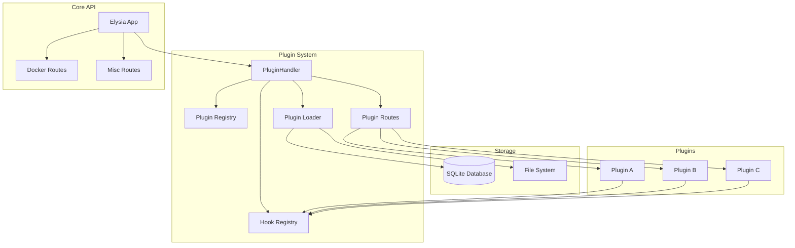
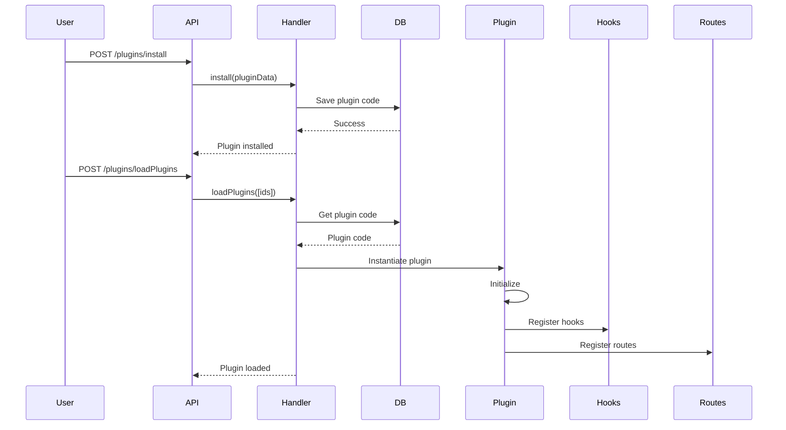
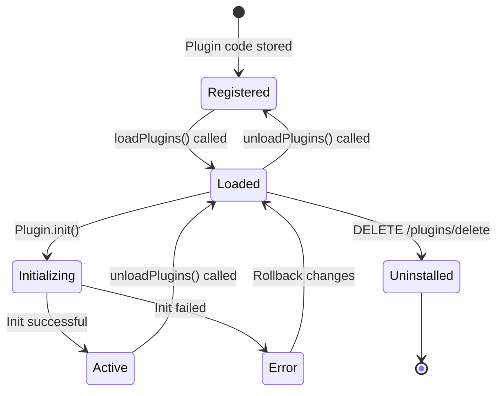
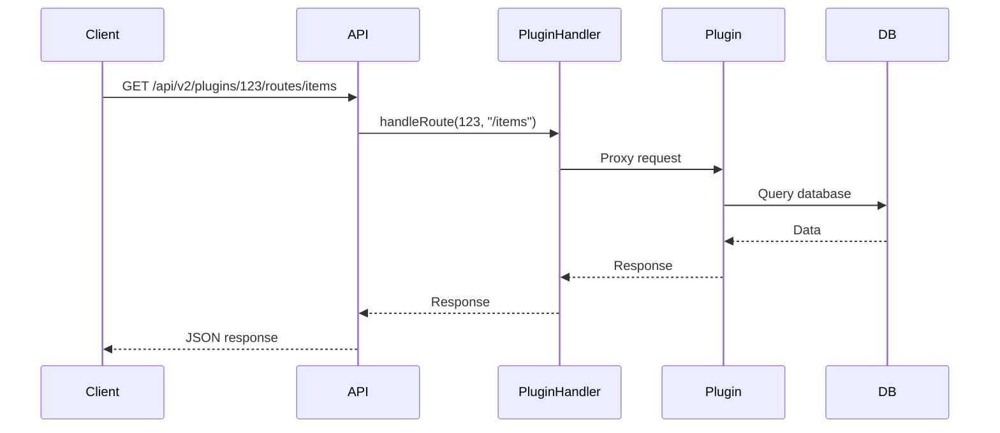
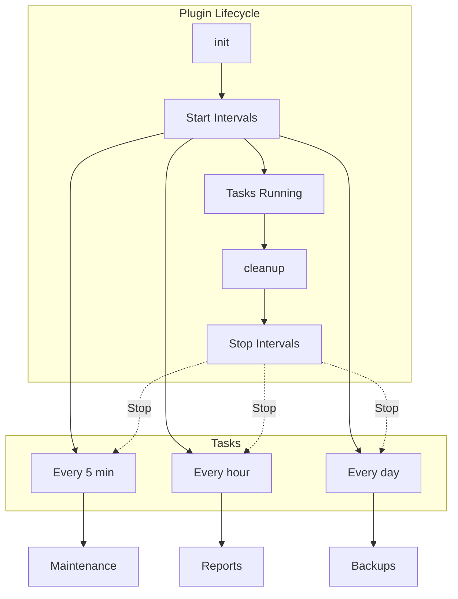
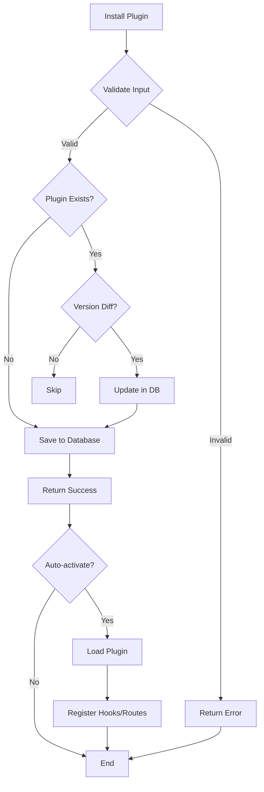

> The DockStat API Plugin System provides a powerful extensibility framework, allowing developers to add custom functionality, API routes, database tables, and event hooks without modifying the core API code.

## Table of Contents

- [Plugin Architecture](#plugin-architecture)
- [Plugin Lifecycle](#plugin-lifecycle)
- [Plugin Structure](#plugin-structure)
- [Plugin Capabilities](#plugin-capabilities)
- [Plugin Development](#plugin-development)
- [Plugin Installation](#plugin-installation)
- [Plugin API](#plugin-api)
- [Best Practices](#best-practices)
- [Security Considerations](#security-considerations)

## Plugin Architecture

### System Overview

The plugin system follows a modular architecture where plugins are self-contained modules that can be loaded, activated, deactivated, and unloaded at runtime.



### Component Interaction



### Plugin Directory Structure

```
src/plugins/
├── index.ts                    # PluginHandler initialization
├── utils/                      # Plugin utility functions
│   └── helpers.ts
└── default-plugins/            # Built-in plugins
    ├── plugin-a/
    │   ├── index.ts
    │   ├── manifest.yml
    │   └── package.json
    └── plugin-b/
        ├── index.ts
        ├── manifest.yml
        └── package.json
```

## Plugin Lifecycle

### Lifecycle States



### Lifecycle Methods

Plugins can implement optional lifecycle hooks:

| Method | Purpose | Return Type |
|--------|---------|-------------|
| `init()` | Initialize plugin, setup resources | `Promise<void>` |
| `cleanup()` | Cleanup resources before unload | `Promise<void>` |
| `activate()` | Called when plugin is activated | `Promise<void>` |
| `deactivate()` | Called when plugin is deactivated | `Promise<void>` |

### Initialization Flow

```mermaid
flowchart TD
    Start[Load Plugin] --> LoadCode[Load Plugin Code]
    LoadCode --> Validate{Validate?}
    
    Validate -->|Invalid| Error1[Return Error]
    Validate -->|Valid| CreateInstance[Create Plugin Instance]
    
    CreateInstance --> CheckInit{Has init?}
    CheckInit -->|Yes| RunInit[Run init()]
    CheckInit -->|No| LoadHooks
    
    RunInit --> InitSuccess{Success?}
    
    InitSuccess -->|Yes| RegisterHooks[Register Hooks]
    InitSuccess -->|No| Cleanup1[Cleanup and Error]
    
    RegisterHooks --> RegisterRoutes{Has Routes?}
    RegisterRoutes -->|Yes| LoadRoutes[Load Plugin Routes]
    RegisterRoutes -->|No| Complete
    
    LoadRoutes --> RegisterDB{Has DB Tables?}
    RegisterDB -->|Yes| CreateTables[Create DB Tables]
    RegisterDB -->|No| Complete
    
    CreateTables --> Complete[Plugin Active]
    
    Cleanup1 --> Error1
    Error1 --> End[End]
    Complete --> End
```

## Plugin Structure

### Plugin Interface

```typescript
export interface DockStatPlugin {
  // Plugin metadata
  id?: number
  name: string
  version: string
  description?: string
  author?: {
    name: string
    email?: string
  }
  
  // Lifecycle hooks
  init?(): Promise<void>
  cleanup?(): Promise<void>
  activate?(): Promise<void>
  deactivate?(): Promise<void>
  
  // Capabilities
  routes?: Elysia
  hooks?: Record<string, HookHandler>
  database?: {
    tables?: TableDefinition[]
    migrations?: Migration[]
  }
  
  // Configuration
  config?: {
    [key: string]: any
  }
}

export interface HookHandler {
  (context: any): Promise<void> | void
}

export interface TableDefinition {
  name: string
  sql: string
}

export interface Migration {
  version: number
  name: string
  up: () => Promise<void>
  down: () => Promise<void>
}
```

### Manifest File

Plugins can include a `manifest.yml` file for metadata:

```yaml
name: "my-awesome-plugin"
version: "1.0.0"
description: "An awesome plugin for DockStat"
author:
  name: "Your Name"
  email: "your.email@example.com"
license: "MIT"
repository: "https://github.com/username/my-awesome-plugin"
homepage: "https://github.com/username/my-awesome-plugin#readme"
keywords:
  - dockstat
  - plugin
  - example
dockstat:
  minVersion: "1.0.0"
  maxVersion: "2.0.0"
  features:
    - "database"
    - "routes"
    - "hooks"
permissions:
  - "docker:read"
  - "docker:write"
  - "database:read"
```

### Example Plugin

```typescript
import Elysia from "elysia"
import { DockStatPlugin } from "@dockstat/plugin-handler"

export default {
  name: "hello-world",
  version: "1.0.0",
  description: "A simple hello world plugin",
  
  // Initialize plugin
  async init() {
    console.log("Hello World Plugin initializing...")
    // Setup resources
  },
  
  // Cleanup on unload
  async cleanup() {
    console.log("Hello World Plugin cleaning up...")
    // Cleanup resources
  },
  
  // Register custom routes
  routes: new Elysia({ prefix: "/hello" })
    .get("/", () => ({ message: "Hello from plugin!" }))
    .post("/greet", ({ body }) => ({
      message: `Hello, ${body.name}!`
    })),
  
  // Register event hooks
  hooks: {
    "container:started": async (context) => {
      console.log("Container started:", context.containerId)
    },
    "container:stopped": async (context) => {
      console.log("Container stopped:", context.containerId)
    }
  },
  
  // Define database tables
  database: {
    tables: [
      {
        name: "hello_greetings",
        sql: `
          CREATE TABLE IF NOT EXISTS hello_greetings (
            id INTEGER PRIMARY KEY AUTOINCREMENT,
            name TEXT NOT NULL,
            message TEXT,
            created_at DATETIME DEFAULT CURRENT_TIMESTAMP
          )
        `
      }
    ]
  }
} satisfies DockStatPlugin
```

## Plugin Capabilities

### 1. Custom API Routes

Plugins can add custom REST endpoints to the API.

```typescript
export default {
  name: "custom-api",
  version: "1.0.0",
  
  routes: new Elysia({ 
    prefix: "/my-plugin",
    detail: {
      tags: ["My Plugin"],
      description: "Custom API endpoints"
    }
  })
    .get("/", () => ({
      success: true,
      message: "Plugin API working"
    }))
    .get("/items", async () => {
      // Fetch items from database
      const items = await db.getItems()
      return { success: true, data: items }
    })
    .post("/items", async ({ body, status }) => {
      // Create new item
      const item = await db.createItem(body)
      return status(201, { success: true, data: item })
    })
    .put("/items/:id", async ({ params, body }) => {
      // Update item
      const item = await db.updateItem(params.id, body)
      return { success: true, data: item }
    })
    .delete("/items/:id", async ({ params }) => {
      // Delete item
      await db.deleteItem(params.id)
      return { success: true, message: "Item deleted" }
    })
} satisfies DockStatPlugin
```

**Route Proxying:**



### 2. Event Hooks

Plugins can register handlers for various system events.

```typescript
export default {
  name: "event-listener",
  version: "1.0.0",
  
  hooks: {
    // Docker container events
    "container:created": async (context) => {
      console.log("Container created:", context.containerId)
      await notifyAdmin(`New container: ${context.name}`)
    },
    
    "container:started": async (context) => {
      console.log("Container started:", context.containerId)
      await logEvent("container_start", context)
    },
    
    "container:stopped": async (context) => {
      console.log("Container stopped:", context.containerId)
      await checkContainerHealth(context.containerId)
    },
    
    "container:removed": async (context) => {
      console.log("Container removed:", context.containerId)
      await cleanupResources(context.containerId)
    },
    
    // Plugin lifecycle events
    "plugin:installed": async (context) => {
      console.log("Plugin installed:", context.pluginId)
      await sendNotification(`New plugin installed: ${context.name}`)
    },
    
    "plugin:activated": async (context) => {
      console.log("Plugin activated:", context.pluginId)
      await runPostActivationTasks(context.pluginId)
    },
    
    // Request/Response events
    "request:received": async (context) => {
      console.log("Request received:", context.path)
      await trackRequest(context)
    },
    
    "response:sent": async (context) => {
      console.log("Response sent:", context.status)
      await logResponse(context)
    }
  }
} satisfies DockStatPlugin
```

**Hook Event Types:**

| Category | Event | Context Data |
|----------|--------|--------------|
| **Docker** | `container:created` | `{ containerId, name, image, ... }` |
| **Docker** | `container:started` | `{ containerId, name, ... }` |
| **Docker** | `container:stopped` | `{ containerId, name, ... }` |
| **Docker** | `container:removed` | `{ containerId, name, ... }` |
| **Plugin** | `plugin:installed` | `{ pluginId, name, version }` |
| **Plugin** | `plugin:activated` | `{ pluginId, name, version }` |
| **Plugin** | `plugin:deactivated` | `{ pluginId, name, version }` |
| **Plugin** | `plugin:removed` | `{ pluginId, name }` |
| **Request** | `request:received` | `{ path, method, headers, body }` |
| **Response** | `response:sent` | `{ status, body, duration }` |
| **Database** | `db:before_query` | `{ query, params }` |
| **Database** | `db:after_query` | `{ query, result, duration }` |

### 3. Database Tables

Plugins can create custom database tables.

```typescript
export default {
  name: "custom-storage",
  version: "1.0.0",
  
  database: {
    tables: [
      {
        name: "plugin_settings",
        sql: `
          CREATE TABLE IF NOT EXISTS plugin_settings (
            id INTEGER PRIMARY KEY AUTOINCREMENT,
            plugin_id INTEGER NOT NULL,
            key TEXT NOT NULL,
            value TEXT,
            updated_at DATETIME DEFAULT CURRENT_TIMESTAMP,
            UNIQUE(plugin_id, key)
          )
        `
      },
      {
        name: "plugin_notifications",
        sql: `
          CREATE TABLE IF NOT EXISTS plugin_notifications (
            id INTEGER PRIMARY KEY AUTOINCREMENT,
            user_id INTEGER,
            type TEXT NOT NULL,
            title TEXT NOT NULL,
            message TEXT,
            read INTEGER DEFAULT 0,
            created_at DATETIME DEFAULT CURRENT_TIMESTAMP
          )
        `
      }
    ]
  }
} satisfies DockStatPlugin
```

**Database Access from Plugins:**

```typescript
export default {
  name: "db-access",
  version: "1.0.0",
  
  async init() {
    // Access main database
    const db = DockStatDB._sqliteWrapper
    
    // Create custom table
    await db.exec(`
      CREATE TABLE IF NOT EXISTS my_plugin_data (
        id INTEGER PRIMARY KEY AUTOINCREMENT,
        data TEXT NOT NULL,
        created_at DATETIME DEFAULT CURRENT_TIMESTAMP
      )
    `)
    
    // Insert data
    await db.table("my_plugin_data").insert({
      data: JSON.stringify({ key: "value" })
    })
    
    // Query data
    const rows = await db.table("my_plugin_data").select(["*"]).all()
    console.log("Data:", rows)
  }
} satisfies DockStatPlugin
```

### 4. Background Tasks

Plugins can run background tasks and scheduled jobs.

```typescript
export default {
  name: "background-tasks",
  version: "1.0.0",
  
  intervals: [] as NodeJS.Timeout[],
  
  async init() {
    // Start background task that runs every 5 minutes
    const taskInterval = setInterval(async () => {
      console.log("Running background task...")
      
      // Perform periodic maintenance
      await this.performMaintenance()
      
      // Check for updates
      await this.checkForUpdates()
      
      // Clean old logs
      await this.cleanupOldLogs()
    }, 5 * 60 * 1000) // 5 minutes
    
    this.intervals.push(taskInterval)
    
    // Start another task that runs hourly
    const hourlyTask = setInterval(async () => {
      await this.generateReport()
    }, 60 * 60 * 1000) // 1 hour
    
    this.intervals.push(hourlyTask)
  },
  
  async cleanup() {
    // Clear all intervals
    for (const interval of this.intervals) {
      clearInterval(interval)
    }
    this.intervals = []
  },
  
  async performMaintenance() {
    // Maintenance logic
  },
  
  async checkForUpdates() {
    // Check for plugin updates
  },
  
  async cleanupOldLogs() {
    // Clean up old log entries
  },
  
  async generateReport() {
    // Generate hourly report
  }
} satisfies DockStatPlugin
```

**Background Task Architecture:**



## Plugin Development

### Development Setup

```bash
# Create plugin directory
mkdir -p src/plugins/my-plugin
cd src/plugins/my-plugin

# Initialize plugin
npm init -y

# Install dependencies
bun add elysia @dockstat/plugin-handler

# Create plugin structure
touch index.ts manifest.yml
```

### Plugin Template

```typescript
// index.ts
import Elysia from "elysia"
import type { DockStatPlugin } from "@dockstat/plugin-handler"

export default {
  name: "my-plugin",
  version: "1.0.0",
  description: "My custom plugin",
  
  // Lifecycle hooks
  async init() {
    console.log(`${this.name} plugin initializing...`)
    // Setup resources, database, etc.
  },
  
  async cleanup() {
    console.log(`${this.name} plugin cleaning up...`)
    // Cleanup resources, close connections, etc.
  },
  
  // Custom routes
  routes: new Elysia({ 
    prefix: "/my-plugin",
    detail: { tags: ["My Plugin"] }
  })
    .get("/", () => ({
      success: true,
      message: "My plugin is working"
    })),
  
  // Event hooks
  hooks: {
    "container:started": async (context) => {
      console.log("Container started:", context.containerId)
    }
  },
  
  // Database tables
  database: {
    tables: [
      {
        name: "my_plugin_data",
        sql: `
          CREATE TABLE IF NOT EXISTS my_plugin_data (
            id INTEGER PRIMARY KEY AUTOINCREMENT,
            data TEXT NOT NULL,
            created_at DATETIME DEFAULT CURRENT_TIMESTAMP
          )
        `
      }
    ]
  }
} satisfies DockStatPlugin
```

### Testing Plugins

```typescript
// test/plugin.test.ts
import { describe, it, expect, beforeEach, afterEach } from "bun:test"
import PluginHandler from "../src/plugins"

describe("My Plugin", () => {
  let pluginId: number
  
  beforeEach(async () => {
    // Install plugin
    const result = await PluginHandler.savePlugin({
      name: "test-plugin",
      version: "1.0.0",
      description: "Test plugin",
      repoType: "local",
      repository: "test",
      manifest: "",
      author: { name: "Test" },
      plugin: `export default {
        name: "test-plugin",
        version: "1.0.0",
        routes: new Elysia()
          .get("/test", () => ({ message: "test" }))
      }`
    })
    
    pluginId = result.id
  })
  
  afterEach(async () => {
    // Cleanup
    await PluginHandler.deletePlugin(pluginId)
  })
  
  it("should load plugin", async () => {
    const result = await PluginHandler.loadPlugins([pluginId])
    expect(result.successes).toContain(pluginId)
  })
  
  it("should register routes", async () => {
    await PluginHandler.loadPlugins([pluginId])
    const routes = PluginHandler.getAllPluginRoutes()
    expect(routes).toHaveLength(1)
  })
})
```

### Debugging Plugins

```typescript
export default {
  name: "debug-plugin",
  version: "1.0.0",
  
  async init() {
    console.log("=== Plugin Init Started ===")
    console.log("Name:", this.name)
    console.log("Version:", this.version)
    console.log("Config:", this.config)
    
    try {
      // Your initialization code
      console.log("Init completed successfully")
    } catch (error) {
      console.error("Init failed:", error)
      throw error
    }
    
    console.log("=== Plugin Init Completed ===")
  },
  
  hooks: {
    "container:started": async (context) => {
      console.log("=== Hook Triggered: container:started ===")
      console.log("Context:", JSON.stringify(context, null, 2))
    }
  }
} satisfies DockStatPlugin
```

## Plugin Installation

### Installation Methods

#### Method 1: API Installation

```bash
# Install plugin via API
curl -X POST http://localhost:3030/api/v2/plugins/install \
  -H "Content-Type: application/json" \
  -d '{
    "name": "my-plugin",
    "version": "1.0.0",
    "description": "My custom plugin",
    "repoType": "local",
    "repository": "my-plugin",
    "manifest": "",
    "author": {
      "name": "Developer",
      "email": "dev@example.com"
    },
    "plugin": "export default { name: \"my-plugin\", version: \"1.0.0\" }"
  }'
```

#### Method 2: Repository Installation

```bash
# Install plugin from repository
curl -X POST http://localhost:3030/api/v2/plugins/install \
  -H "Content-Type: application/json" \
  -d '{
    "name": "example-plugin",
    "version": "1.0.0",
    "repoType": "github",
    "repository": "username/repo",
    "manifest": "manifest.yml"
  }'
```

#### Method 3: File Installation

```bash
# Install plugin from file
curl -X POST http://localhost:3030/api/v2/plugins/install \
  -F "file=@/path/to/plugin.tar.gz"
```

### Installation Flow



### Activation

```bash
# Activate plugin by ID
curl -X POST http://localhost:3030/api/v2/plugins/loadPlugins \
  -H "Content-Type: application/json" \
  -d '[1, 2, 3]'

# Response
{
  "successes": [1, 2],
  "errors": [
    {
      "pluginId": 3,
      "error": "Initialization failed"
    }
  ]
}
```

### Deactivation

```bash
# Deactivate plugin
curl -X POST http://localhost:3030/api/v2/plugins/unloadPlugins \
  -H "Content-Type: application/json" \
  -d '{
    "ids": [3]
  }'
```

### Removal

```bash
# Delete plugin
curl -X POST http://localhost:3030/api/v2/plugins/delete \
  -H "Content-Type: application/json" \
  -d '{
    "pluginId": 3
  }'
```

## Plugin API

### PluginHandler API

```typescript
class PluginHandler {
  // Install a new plugin
  async savePlugin(data: InstallPluginData): Promise<{ id: number }>
  
  // Load plugins by IDs
  async loadPlugins(ids: number[]): Promise<LoadResult>
  
  // Unload plugins by IDs
  async unloadPlugins(ids: number[]): Promise<void>
  
  // Delete a plugin
  async deletePlugin(pluginId: number): Promise<void>
  
  // Get all installed plugins
  getAll(): InstalledPlugin[]
  
  // Get plugin by ID
  getById(pluginId: number): InstalledPlugin | undefined
  
  // Get all plugin routes
  getAllPluginRoutes(): PluginRoute[]
  
  // Get hook handlers
  getHookHandlers(): Map<number, Record<string, HookHandler>>
  
  // Get plugin status
  getStatus(): PluginStatus
}
```

### Route Handlers

```typescript
// List all plugins
GET /api/v2/plugins/all

// Response
{
  "total": 3,
  "plugins": [
    {
      "id": 1,
      "name": "hello-world",
      "version": "1.0.0",
      "active": true,
      "loaded": true
    }
  ]
}

// Get plugin status
GET /api/v2/plugins/status

// Response
{
  "totalPlugins": 5,
  "activePlugins": 3,
  "loadedPlugins": 4,
  "totalRoutes": 15,
  "totalHooks": 12
}

// List available hooks
GET /api/v2/plugins/hooks

// Response
[
  {
    "pluginId": 1,
    "hooks": [
      "container:started",
      "container:stopped"
    ]
  }
]

// List plugin routes
GET /api/v2/plugins/routes

// Response
[
  {
    "pluginId": 1,
    "routes": [
      {
        "method": "GET",
        "path": "/hello",
        "handler": "helloWorldHandler"
      }
    ]
  }
]
```

### Frontend Plugin Routes

```typescript
// Get frontend plugins
GET /api/v2/plugins/frontend/all

// Response
{
  "plugins": [
    {
      "id": 1,
      "name": "dashboard-widget",
      "version": "1.0.0",
      "description": "Custom dashboard widget",
      "frontend": {
        "component": "DashboardWidget",
        "styles": "/plugins/1/styles.css"
      }
    }
  ]
}

// Get plugin manifest
GET /api/v2/plugins/frontend/:id/manifest

// Get plugin code
GET /api/v2/plugins/frontend/:id/code
```

## Best Practices

### 1. Error Handling

```typescript
export default {
  name: "robust-plugin",
  version: "1.0.0",
  
  async init() {
    try {
      // Initialize resources
      await this.connectDatabase()
      await this.setupRoutes()
    } catch (error) {
      console.error("Plugin initialization failed:", error)
      // Clean up partially initialized resources
      await this.cleanup()
      throw error
    }
  },
  
  async connectDatabase() {
    try {
      // Connect to database
    } catch (error) {
      throw new Error(`Database connection failed: ${error.message}`)
    }
  },
  
  async cleanup() {
    try {
      // Cleanup all resources
      await this.closeDatabase()
      await this.stopTasks()
    } catch (error) {
      console.error("Cleanup error:", error)
    }
  }
} satisfies DockStatPlugin
```

### 2. Resource Management

```typescript
export default {
  name: "resource-safe-plugin",
  version: "1.0.0",
  
  resources: {
    connections: [] as any[],
    intervals: [] as NodeJS.Timeout[],
    timeouts: [] as NodeJS.Timeout[]
  },
  
  async init() {
    // Create connection
    const db = await createConnection()
    this.resources.connections.push(db)
    
    // Start interval
    const interval = setInterval(() => this.task(), 60000)
    this.resources.intervals.push(interval)
    
    // Start timeout
    const timeout = setTimeout(() => this.oneTimeTask(), 5000)
    this.resources.timeouts.push(timeout)
  },
  
  async cleanup() {
    // Close all connections
    for (const conn of this.resources.connections) {
      try {
        await conn.close()
      } catch (error) {
        console.error("Error closing connection:", error)
      }
    }
    this.resources.connections = []
    
    // Clear all intervals
    for (const interval of this.resources.intervals) {
      clearInterval(interval)
    }
    this.resources.intervals = []
    
    // Clear all timeouts
    for (const timeout of this.resources.timeouts) {
      clearTimeout(timeout)
    }
    this.resources.timeouts = []
  }
} satisfies DockStatPlugin
```

### 3. Configuration

```typescript
export default {
  name: "configurable-plugin",
  version: "1.0.0",
  
  config: {
    apiKey: process.env.PLUGIN_API_KEY || "",
    endpoint: process.env.PLUGIN_ENDPOINT || "https://api.example.com",
    refreshInterval: 60, // seconds
    maxRetries: 3,
    debug: false
  },
  
  async init() {
    // Validate configuration
    if (!this.config.apiKey) {
      throw new Error("API key is required")
    }
    
    if (this.config.debug) {
      console.log("Plugin config:", this.config)
    }
    
    // Use configuration
    this.setupRefreshTask(this.config.refreshInterval)
  },
  
  setupRefreshTask(intervalSeconds: number) {
    setInterval(async () => {
      try {
        await this.fetchData(this.config.endpoint, this.config.apiKey)
      } catch (error) {
        console.error("Fetch failed:", error)
      }
    }, intervalSeconds * 1000)
  }
} satisfies DockStatPlugin
```

### 4. Logging

```typescript
export default {
  name: "logging-plugin",
  version: "1.0.0",
  
  logger: null as any,
  
  async init() {
    // Create dedicated logger
    this.logger = BaseLogger.spawn(this.name)
    
    this.logger.info("Plugin initializing")
    
    try {
      await this.setupPlugin()
      this.logger.info("Plugin initialized successfully")
    } catch (error) {
      this.logger.error("Plugin initialization failed", { error })
      throw error
    }
  },
  
  async setupPlugin() {
    this.logger.debug("Setting up plugin resources")
    // Setup code
    this.logger.debug("Resources setup complete")
  }
} satisfies DockStatPlugin
```

### 5. Version Compatibility

```typescript
export default {
  name: "compatible-plugin",
  version: "2.0.0",
  
  // Specify DockStat version compatibility
  compatibility: {
    minVersion: "1.0.0",
    maxVersion: "2.5.0"
  },
  
  // Support multiple versions of same API
  async init() {
    const apiVersion = process.env.DOCKSTAT_VERSION || "1.0.0"
    
    if (this.isVersionCompatible(apiVersion)) {
      console.log("Compatible API version:", apiVersion)
      await this.initCompatible(apiVersion)
    } else {
      console.warn("Incompatible API version:", apiVersion)
      await this.initFallback()
    }
  },
  
  isVersionCompatible(version: string): boolean {
    // Version comparison logic
    return true
  },
  
  async initCompatible(version: string) {
    // Initialize for compatible version
  },
  
  async initFallback() {
    // Initialize fallback functionality
  }
} satisfies DockStatPlugin
```

### 6. Performance

```typescript
export default {
  name: "performant-plugin",
  version: "1.0.0",
  
  cache: new Map(),
  cacheTimeout: 5 * 60 * 1000, // 5 minutes
  
  async init() {
    // Initialize cache cleanup
    setInterval(() => this.cleanupCache(), 60000)
  },
  
  async getData(key: string) {
    // Check cache first
    const cached = this.cache.get(key)
    if (cached && Date.now() - cached.timestamp < this.cacheTimeout) {
      return cached.data
    }
    
    // Fetch fresh data
    const data = await this.fetchData(key)
    
    // Cache data
    this.cache.set(key, {
      data,
      timestamp: Date.now()
    })
    
    return data
  },
  
  cleanupCache() {
    const now = Date.now()
    for (const [key, value] of this.cache.entries()) {
      if (now - value.timestamp > this.cacheTimeout) {
        this.cache.delete(key)
      }
    }
  }
} satisfies DockStatPlugin
```

## Security Considerations

### 1. Input Validation

```typescript
export default {
  name: "secure-plugin",
  version: "1.0.0",
  
  routes: new Elysia({ prefix: "/secure" })
    .get(
      "/search",
      async ({ query, status }) => {
        // Validate and sanitize input
        if (query.q) {
          const sanitized = this.sanitizeInput(query.q)
          const results = await this.search(sanitized)
          return status(200, { success: true, results })
        }
        return status(400, { success: false, error: "Query required" })
      },
      {
        query: t.Object({
          q: t.String({ minLength: 1, maxLength: 100 }),
          limit: t.Optional(t.Number({ minimum: 1, maximum: 100 }))
        })
      }
    ),
  
  sanitizeInput(input: string): string {
    // Remove dangerous characters
    return input.replace(/[<>'"&]/g, '')
  }
} satisfies DockStatPlugin
```

### 2. Database Security

```typescript
export default {
  name: "db-secure-plugin",
  version: "1.0.0",
  
  async init() {
    // Use parameterized queries
    const result = await DockStatDB._sqliteWrapper
      .table("plugin_data")
      .select(["*"])
      .where({ 
        user_id: this.userId,  // Parameterized
        status: "active"
      })
      .all()
    
    // Never concatenate user input into SQL
    // Bad: `SELECT * FROM data WHERE id = ${userId}`
    // Good: Use parameterized queries
  }
} satisfies DockStatPlugin
```

### 3. Sensitive Data

```typescript
export default {
  name: "secure-secrets",
  version: "1.0.0",
  
  config: {
    // Never log sensitive data
    apiKey: process.env.API_KEY,
    secret: process.env.SECRET
  },
  
  async init() {
    // Don't log sensitive config
    this.logger.info("Plugin initialized", {
      hasApiKey: !!this.config.apiKey,
      hasSecret: !!this.config.secret
    })
    // Instead of:
    // this.logger.info("Config:", this.config) // BAD!
  }
} satisfies DockStatPlugin
```

### 4. Permission Checks

```typescript
export default {
  name: "permission-plugin",
  version: "1.0.0",
  
  permissions: {
    read: true,
    write: false,
    admin: false
  },
  
  routes: new Elysia({ prefix: "/protected" })
    .post(
      "/action",
      async ({ body, status }) => {
        // Check permissions
        if (!this.permissions.write) {
          return status(403, {
            success: false,
            error: "Write permission required"
          })
        }
        
        // Perform action
        return status(200, { success: true })
      }
    )
} satisfies DockStatPlugin
```

## Related Documentation

- [API Architecture Overview](../api-architecture/README.md)
- [API Development Guide](../api-development/README.md)
- [API Patterns](../api-patterns/README.md)
- [WebSocket Documentation](../api-websockets/README.md)
- [API Reference](../api-reference/README.md)