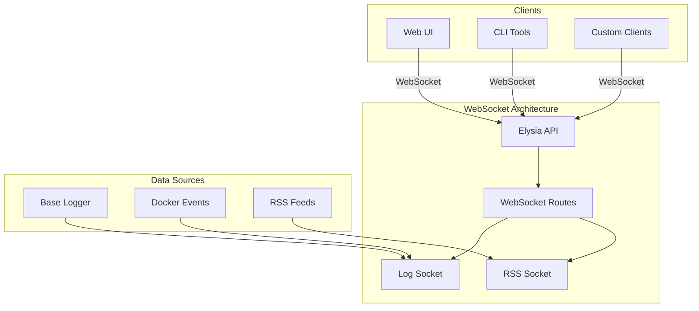
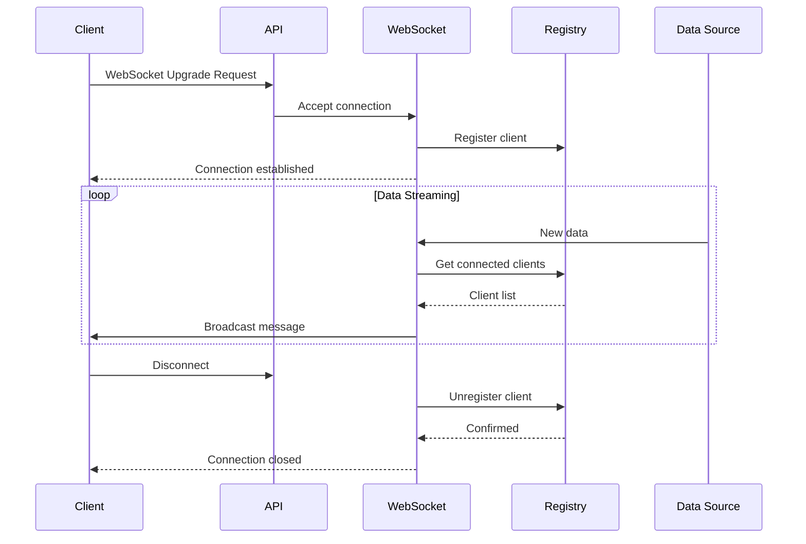
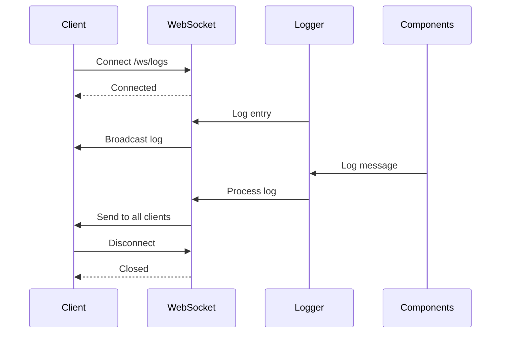
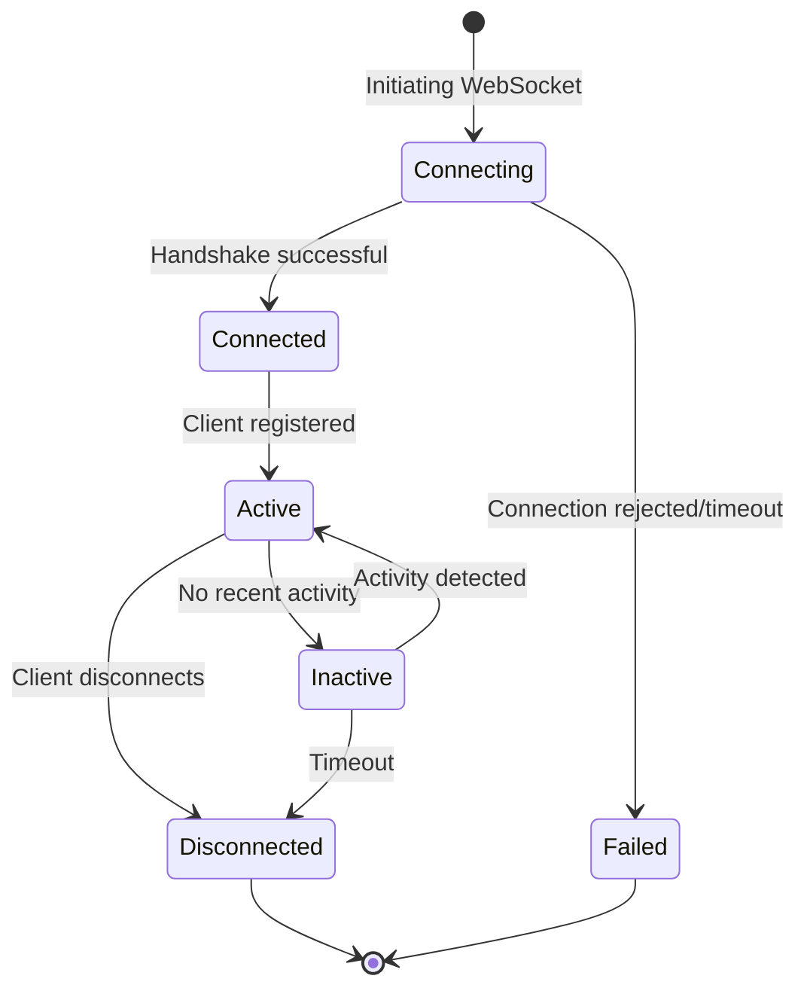
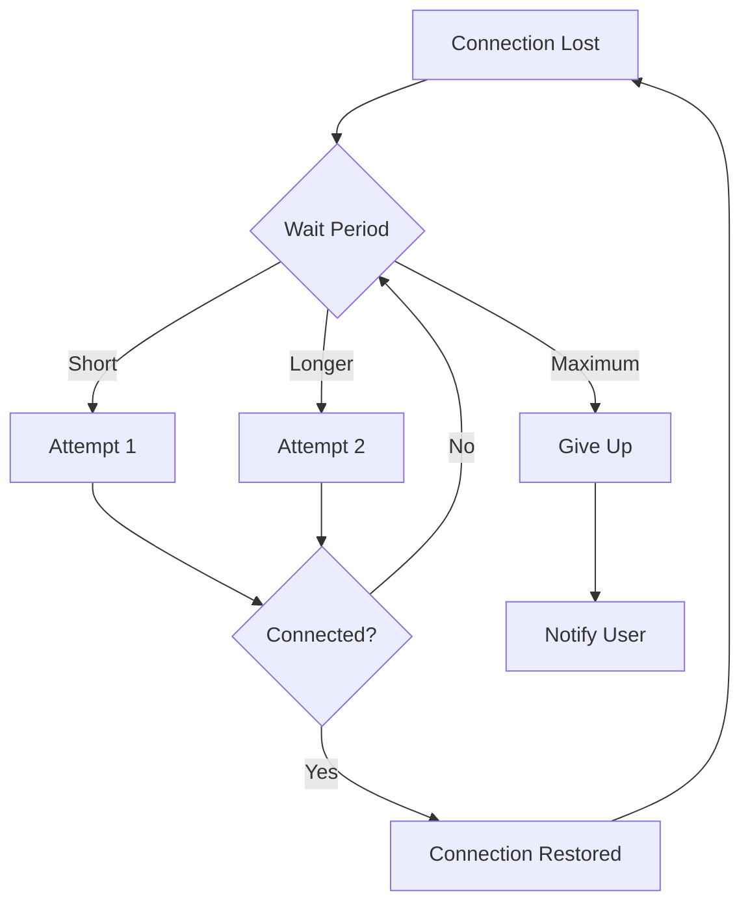
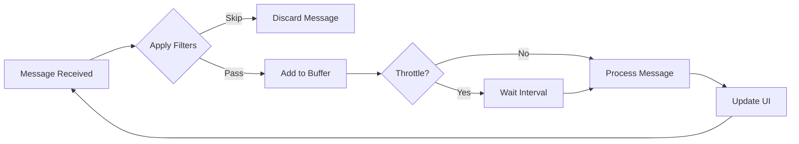

id: api-websockets-guide
title: API WebSocket Documentation
collectionId: b4a5e48f-f103-480b-9f50-8f53f515cab9
parentDocumentId: 7dddd764-6483-4f84-96a3-988304e772d3
updatedAt: 2026-01-01T15:02:00.000Z
urlId: api-websockets-guide
---

> This document describes the WebSocket endpoints and real-time communication capabilities of the DockStat API, enabling live updates and streaming data.

## Table of Contents

- [WebSocket Architecture](#websocket-architecture)
- [Available Endpoints](#available-endpoints)
- [Connection Management](#connection-management)
- [Message Formats](#message-formats)
- [Usage Examples](#usage-examples)
- [Best Practices](#best-practices)
- [Troubleshooting](#troubleshooting)

## WebSocket Architecture

### Overview

The DockStat API provides real-time communication through WebSocket endpoints, enabling:
- Live log streaming
- Real-time container statistics
- Event notifications
- RSS feed updates



### Connection Flow



### Implementation Pattern

The WebSocket implementation follows a consistent pattern across all endpoints:

```typescript
import Elysia, { t } from "elysia"
import type { ElysiaWS } from "elysia/ws"

// Client registry
export const clients = new Set<ElysiaWS<Context>>()

// WebSocket endpoint
export const ExampleSocket = new Elysia()
  .ws("/ws/example", {
    // Message schema for type safety
    response: t.Object({
      type: t.String(),
      data: t.Any(),
      timestamp: t.Date(),
    }),

    // Connection lifecycle handlers
    open(ws) {
      clients.add(ws)
      // Send welcome message
      ws.send({ type: "connected", data: "Welcome!", timestamp: new Date() })
    },

    message(ws, message) {
      // Handle incoming messages
      console.log("Received:", message)
    },

    close(ws) {
      clients.delete(ws)
    },

    error(ws, error) {
      console.error("WebSocket error:", error)
    },
  })
```

## Available Endpoints

### 1. Log Streaming WebSocket

**Endpoint:** `ws://localhost:3030/ws/logs`

**Purpose:** Real-time streaming of application logs from the DockStat API and its components.

**Client Registry:**
```typescript
export const logClients = new Set<ElysiaWS<Context>>()
```

**Message Format:**

```typescript
{
  level: "error" | "warn" | "info" | "debug",
  message: string,
  name: string,           // Logger name (e.g., "DockStatAPI")
  parents: string[],       // Parent logger names
  requestId?: string,      // Request identifier
  timestamp: Date,
  caller: string           // Source file/function
}
```

**Example Messages:**

```json
{
  "level": "info",
  "message": "Container nginx started",
  "name": "DockerClientManager",
  "parents": ["DockStatAPI"],
  "requestId": "req_12345",
  "timestamp": "2024-01-15T10:30:00.000Z",
  "caller": "Worker:123"
}

{
  "level": "error",
  "message": "Failed to connect to Docker daemon",
  "name": "DockerClientManager",
  "parents": [],
  "timestamp": "2024-01-15T10:31:00.000Z",
  "caller": "initWorker"
}
```

**Connection Flow:**



### 2. RSS Feed WebSocket

**Endpoint:** `ws://localhost:3030/ws/rss`

**Purpose:** Real-time updates from RSS feeds (e.g., plugin repository updates, system notifications).

**Message Format:**

```typescript
{
  type: "feed_update" | "new_item",
  source: string,         // RSS feed URL or identifier
  title: string,
  link: string,
  publishedAt: Date,
  content?: string,
  tags?: string[],
  timestamp: Date
}
```

**Example Message:**

```json
{
  "type": "new_item",
  "source": "https://dockstore.itsnik.de/updates.xml",
  "title": "New version of monitoring plugin available",
  "link": "https://github.com/user/repo/releases/v2.0.0",
  "publishedAt": "2024-01-15T09:00:00.000Z",
  "content": "Version 2.0.0 includes performance improvements...",
  "tags": ["plugin", "monitoring", "update"],
  "timestamp": "2024-01-15T09:05:00.000Z"
}
```

## Connection Management

### Client Lifecycle



### Connection States

| State | Description | Duration | Behavior |
|-------|-------------|----------|----------|
| **Connecting** | WebSocket handshake in progress | < 5 seconds | Waiting for server response |
| **Connected** | Connection established | - | Client registered, receiving messages |
| **Active** | Client actively communicating | - | Sending/receiving messages |
| **Inactive** | No recent activity | 30+ seconds | May be disconnected automatically |
| **Disconnected** | Connection closed | - | Client removed from registry |
| **Failed** | Connection attempt failed | - | Error returned to client |

### Reconnection Strategy



**Recommended Reconnection Logic:**

```typescript
class WebSocketManager {
  private ws: WebSocket | null = null
  private retryCount = 0
  private maxRetries = 5
  private baseDelay = 1000

  connect(url: string) {
    this.ws = new WebSocket(url)

    this.ws.onopen = () => {
      console.log("Connected")
      this.retryCount = 0
    }

    this.ws.onclose = () => {
      console.log("Disconnected")
      this.scheduleReconnect(url)
    }

    this.ws.onerror = (error) => {
      console.error("WebSocket error:", error)
    }
  }

  private scheduleReconnect(url: string) {
    if (this.retryCount >= this.maxRetries) {
      console.error("Max retries reached")
      return
    }

    const delay = this.baseDelay * Math.pow(2, this.retryCount)
    this.retryCount++

    console.log(`Reconnecting in ${delay}ms (attempt ${this.retryCount})`)
    setTimeout(() => this.connect(url), delay)
  }
}

// Usage
const manager = new WebSocketManager()
manager.connect("ws://localhost:3030/ws/logs")
```

## Message Formats

### Standard Message Structure

All WebSocket messages follow a consistent structure:

```typescript
interface WSMessage<T = any> {
  type: string        // Message type identifier
  data: T             // Message payload
  timestamp: Date     // ISO 8601 timestamp
  id?: string         // Unique message identifier (optional)
  metadata?: {        // Additional metadata (optional)
    [key: string]: any
  }
}
```

### Log Message Types

```typescript
type LogLevel = "error" | "warn" | "info" | "debug"

interface LogMessage extends WSMessage {
  type: "log"
  level: LogLevel
  message: string
  logger: {
    name: string
    parents: string[]
  }
  context?: {
    requestId?: string
    userId?: string
    [key: string]: any
  }
  caller: {
    file: string
    line?: number
    function: string
  }
}
```

### Event Message Types

```typescript
interface DockerEventMessage extends WSMessage {
  type: "docker_event"
  event: string
  data: {
    containerId: string
    containerName: string
    image: string
    timestamp: Date
  }
}

interface PluginEventMessage extends WSMessage {
  type: "plugin_event"
  event: "installed" | "activated" | "deactivated" | "removed"
  pluginId: number
  pluginName: string
  version: string
}
```

### Control Messages

Clients can send control messages to the server:

```typescript
interface PingMessage {
  type: "ping"
  timestamp: Date
}

interface PongMessage {
  type: "pong"
  timestamp: Date
  originalTimestamp: Date
}

interface SubscribeMessage {
  type: "subscribe"
  topics: string[]
}

interface UnsubscribeMessage {
  type: "unsubscribe"
  topics?: string[]  // Empty array = unsubscribe all
}
```

### Error Messages

```typescript
interface ErrorMessage extends WSMessage {
  type: "error"
  code: string           // Error code
  message: string         // Human-readable error
  details?: any          // Additional error details
  recoverable: boolean   // Whether the error is recoverable
}
```

**Example Error:**

```json
{
  "type": "error",
  "data": {
    "code": "AUTH_FAILED",
    "message": "Authentication failed",
    "details": {
      "reason": "Invalid token"
    },
    "recoverable": false
  },
  "timestamp": "2024-01-15T10:30:00.000Z"
}
```

## Usage Examples

### Browser JavaScript Example

```html
<!DOCTYPE html>
<html>
<head>
  <title>DockStat Log Viewer</title>
  <style>
    #logs {
      font-family: monospace;
      background: #1a1a1a;
      color: #e0e0e0;
      padding: 20px;
      height: 500px;
      overflow-y: auto;
    }
    .error { color: #ff6b6b; }
    .warn { color: #feca57; }
    .info { color: #48dbfb; }
    .debug { color: #a29bfe; }
  </style>
</head>
<body>
  <div id="logs"></div>
  <button onclick="disconnect()">Disconnect</button>

  <script>
    let ws = null
    const logsDiv = document.getElementById('logs')

    function connect() {
      ws = new WebSocket('ws://localhost:3030/ws/logs')

      ws.onopen = () => {
        console.log('Connected to log stream')
        addLog('Connected to log stream', 'info')
      }

      ws.onmessage = (event) => {
        const log = JSON.parse(event.data)
        displayLog(log)
      }

      ws.onerror = (error) => {
        console.error('WebSocket error:', error)
        addLog('WebSocket error occurred', 'error')
      }

      ws.onclose = () => {
        console.log('Disconnected from log stream')
        addLog('Disconnected', 'warn')
        // Attempt to reconnect after 3 seconds
        setTimeout(connect, 3000)
      }
    }

    function displayLog(log) {
      const timestamp = new Date(log.timestamp).toLocaleTimeString()
      const level = log.level
      const message = log.message
      const source = log.name

      const logEntry = document.createElement('div')
      logEntry.className = level
      logEntry.textContent = `[${timestamp}] [${source}] ${message}`
      
      logsDiv.appendChild(logEntry)
      logsDiv.scrollTop = logsDiv.scrollHeight
    }

    function addLog(message, level) {
      displayLog({
        timestamp: new Date(),
        level,
        message,
        name: 'System'
      })
    }

    function disconnect() {
      if (ws) {
        ws.close()
      }
    }

    // Start connection
    connect()
  </script>
</body>
</html>
```

### Node.js Example

```javascript
const WebSocket = require('ws')

class LogStreamer {
  constructor(url) {
    this.url = url
    this.ws = null
    this.reconnectAttempts = 0
    this.maxReconnectAttempts = 5
  }

  connect() {
    this.ws = new WebSocket(this.url)

    this.ws.on('open', () => {
      console.log('Connected to log stream')
      this.reconnectAttempts = 0
    })

    this.ws.on('message', (data) => {
      this.handleMessage(JSON.parse(data))
    })

    this.ws.on('error', (error) => {
      console.error('WebSocket error:', error.message)
    })

    this.ws.on('close', () => {
      console.log('Connection closed')
      this.attemptReconnect()
    })
  }

  handleMessage(log) {
    const timestamp = new Date(log.timestamp).toISOString()
    const level = log.level.toUpperCase().padEnd(5)
    const source = log.name.padEnd(20)
    
    console.log(`[${timestamp}] [${level}] [${source}] ${log.message}`)
  }

  attemptReconnect() {
    if (this.reconnectAttempts >= this.maxReconnectAttempts) {
      console.error('Max reconnection attempts reached')
      return
    }

    const delay = Math.pow(2, this.reconnectAttempts) * 1000
    this.reconnectAttempts++

    console.log(`Reconnecting in ${delay}ms... (attempt ${this.reconnectAttempts})`)
    
    setTimeout(() => this.connect(), delay)
  }
}

// Usage
const streamer = new LogStreamer('ws://localhost:3030/ws/logs')
streamer.connect()
```

### React Hook Example

```typescript
import { useEffect, useRef, useState } from 'react'

interface LogMessage {
  level: 'error' | 'warn' | 'info' | 'debug'
  message: string
  name: string
  timestamp: string
}

export function useLogStream(url: string) {
  const [logs, setLogs] = useState<LogMessage[]>([])
  const [connected, setConnected] = useState(false)
  const wsRef = useRef<WebSocket | null>(null)

  useEffect(() => {
    wsRef.current = new WebSocket(url)

    wsRef.current.onopen = () => {
      setConnected(true)
    }

    wsRef.current.onmessage = (event) => {
      const log = JSON.parse(event.data)
      setLogs(prev => [...prev, log].slice(-100)) // Keep last 100 logs
    }

    wsRef.current.onclose = () => {
      setConnected(false)
    }

    return () => {
      wsRef.current?.close()
    }
  }, [url])

  const clearLogs = () => setLogs([])

  return { logs, connected, clearLogs }
}

// Usage in component
function LogViewer() {
  const { logs, connected, clearLogs } = useLogStream('ws://localhost:3030/ws/logs')

  return (
    <div>
      <div className="mb-4">
        Status: {connected ? 
          <span className="text-green-500">Connected</span> : 
          <span className="text-red-500">Disconnected</span>
        }
        <button onClick={clearLogs} className="ml-4">
          Clear Logs
        </button>
      </div>
      
      <div className="bg-gray-900 text-white p-4 h-96 overflow-y-auto font-mono">
        {logs.map((log, index) => (
          <div key={index} className={`text-${log.level === 'error' ? 'red' : log.level === 'warn' ? 'yellow' : 'white'}-400`}>
            [{new Date(log.timestamp).toLocaleTimeString()}] [{log.name}] {log.message}
          </div>
        ))}
      </div>
    </div>
  )
}
```

### Python Example

```python
import websocket
import json
from datetime import datetime

class LogListener:
    def __init__(self, url):
        self.url = url
        self.ws = None

    def on_open(self, ws):
        print(f"Connected to {self.url}")

    def on_message(self, ws, message):
        log = json.loads(message)
        timestamp = datetime.fromisoformat(log['timestamp'])
        level = log['level'].upper()
        source = log['name']
        
        print(f"[{timestamp}] [{level}] [{source}] {log['message']}")

    def on_error(self, ws, error):
        print(f"Error: {error}")

    def on_close(self, ws, close_status_code, close_msg):
        print("Connection closed")
        # Reconnect logic
        self.connect()

    def connect(self):
        self.ws = websocket.WebSocketApp(
            self.url,
            on_open=self.on_open,
            on_message=self.on_message,
            on_error=self.on_error,
            on_close=self.on_close
        )
        self.ws.run_forever()

# Usage
listener = LogListener("ws://localhost:3030/ws/logs")
listener.connect()
```

### cURL Example (for testing)

```bash
# Note: cURL doesn't support WebSocket directly
# Use websocat for WebSocket testing

# Install websocat
cargo install websocat

# Connect to log stream
websocat ws://localhost:3030/ws/logs

# With pretty printing
websocat ws://localhost:3030/ws/logs --json | jq

# Filter for errors only
websocat ws://localhost:3030/ws/logs --json | jq 'select(.level == "error")'
```

## Best Practices

### 1. Message Filtering

```typescript
// Client-side filtering to reduce processing
class FilteredLogStreamer {
  private ws: WebSocket
  private filters: LogFilter

  constructor(url: string, filters: LogFilter) {
    this.filters = filters
    this.ws = new WebSocket(url)

    this.ws.onmessage = (event) => {
      const log = JSON.parse(event.data)
      
      if (this.shouldDisplay(log)) {
        this.displayLog(log)
      }
    }
  }

  private shouldDisplay(log: LogMessage): boolean {
    // Filter by level
    if (this.filters.minLevel && !this.meetsLevel(log.level, this.filters.minLevel)) {
      return false
    }

    // Filter by logger name
    if (this.filters.loggers?.length && !this.filters.loggers.includes(log.name)) {
      return false
    }

    // Filter by content
    if (this.filters.search && !log.message.includes(this.filters.search)) {
      return false
    }

    return true
  }

  private meetsLevel(level: string, minLevel: string): boolean {
    const levels = ['debug', 'info', 'warn', 'error']
    return levels.indexOf(level) >= levels.indexOf(minLevel)
  }
}

interface LogFilter {
  minLevel?: 'debug' | 'info' | 'warn' | 'error'
  loggers?: string[]
  search?: string
}
```

### 2. Rate Limiting

```typescript
class RateLimitedHandler {
  private messages: any[] = []
  private lastUpdate = 0
  private interval = 1000 // Update every second

  handleMessage(message: any) {
    this.messages.push(message)
    this.flushIfNeeded()
  }

  private flushIfNeeded() {
    const now = Date.now()
    if (now - this.lastUpdate >= this.interval) {
      this.flush()
      this.lastUpdate = now
    }
  }

  private flush() {
    if (this.messages.length > 0) {
      this.displayMessages(this.messages)
      this.messages = []
    }
  }

  private displayMessages(messages: any[]) {
    // Display messages to user
    console.log(`Processing ${messages.length} messages`)
  }
}
```

### 3. Buffer Management

```typescript
class LogBuffer {
  private buffer: any[] = []
  private maxSize = 1000

  add(message: any) {
    this.buffer.push(message)
    
    // Remove old messages if buffer is full
    if (this.buffer.length > this.maxSize) {
      this.buffer.splice(0, this.buffer.length - this.maxSize)
    }
  }

  get(count?: number): any[] {
    if (count) {
      return this.buffer.slice(-count)
    }
    return [...this.buffer]
  }

  clear() {
    this.buffer = []
  }

  filter(predicate: (msg: any) => boolean): any[] {
    return this.buffer.filter(predicate)
  }
}
```

### 4. Connection Health Monitoring

```typescript
class ConnectionMonitor {
  private ws: WebSocket
  private lastPong = Date.now()
  private pingInterval: NodeJS.Timeout
  private readonly PING_INTERVAL = 30000 // 30 seconds

  constructor(ws: WebSocket) {
    this.ws = ws
    this.startMonitoring()
  }

  private startMonitoring() {
    // Send ping every 30 seconds
    this.pingInterval = setInterval(() => {
      this.sendPing()
      this.checkHealth()
    }, this.PING_INTERVAL)
  }

  private sendPing() {
    this.ws.send(JSON.stringify({
      type: 'ping',
      timestamp: new Date().toISOString()
    }))
  }

  private checkHealth() {
    const now = Date.now()
    const timeSinceLastPong = now - this.lastPong

    if (timeSinceLastPong > this.PING_INTERVAL * 2) {
      console.warn('No pong received recently, connection may be dead')
      this.ws.close()
    }
  }

  handlePong() {
    this.lastPong = Date.now()
  }

  stop() {
    clearInterval(this.pingInterval)
  }
}
```

### 5. Reconnection with Backoff

```typescript
class ReconnectingWebSocket {
  private ws: WebSocket | null = null
  private url: string
  private retryCount = 0
  private maxRetries = 10
  private baseDelay = 1000
  private maxDelay = 30000

  constructor(url: string) {
    this.url = url
    this.connect()
  }

  private connect() {
    this.ws = new WebSocket(this.url)
    this.setupHandlers()
  }

  private setupHandlers() {
    if (!this.ws) return

    this.ws.onopen = () => {
      console.log('Connected')
      this.retryCount = 0
    }

    this.ws.onclose = () => {
      console.log('Disconnected')
      this.scheduleReconnect()
    }

    this.ws.onerror = (error) => {
      console.error('WebSocket error:', error)
    }
  }

  private scheduleReconnect() {
    if (this.retryCount >= this.maxRetries) {
      console.error('Max retries reached, giving up')
      return
    }

    const delay = Math.min(
      this.baseDelay * Math.pow(2, this.retryCount),
      this.maxDelay
    )

    this.retryCount++
    console.log(`Reconnecting in ${delay}ms (attempt ${this.retryCount})`)

    setTimeout(() => this.connect(), delay)
  }

  send(data: any) {
    if (this.ws && this.ws.readyState === WebSocket.OPEN) {
      this.ws.send(JSON.stringify(data))
    } else {
      console.warn('WebSocket is not connected, message not sent')
    }
  }

  close() {
    if (this.ws) {
      this.ws.close()
      this.ws = null
    }
  }
}
```

## Troubleshooting

### Common Issues

#### 1. Connection Failed

**Symptoms:**
- WebSocket connection immediately fails
- `WebSocket connection to 'ws://...' failed` error

**Possible Causes:**
- API server not running
- Wrong port or URL
- Firewall blocking connection
- WebSocket support disabled in server

**Solutions:**
```bash
# Check if API is running
curl http://localhost:3030/api/v2/status/health

# Check if WebSocket endpoint exists
curl -i -N \
  -H "Connection: Upgrade" \
  -H "Upgrade: websocket" \
  -H "Host: localhost:3030" \
  -H "Origin: http://localhost:3030" \
  http://localhost:3030/ws/logs

# Verify WebSocket support in server logs
grep "WebSocket" logs/api.log
```

#### 2. Connection Drops

**Symptoms:**
- Connection established but drops frequently
- Random disconnections

**Possible Causes:**
- Network instability
- Server restarting
- Keepalive timeout
- Proxy/connection limits

**Solutions:**
```typescript
// Implement keepalive
setInterval(() => {
  if (ws.readyState === WebSocket.OPEN) {
    ws.send(JSON.stringify({ type: 'ping' }))
  }
}, 30000) // Send ping every 30 seconds

// Handle reconnection (see Reconnection with Backoff above)
```

#### 3. No Messages Received

**Symptoms:**
- Connection established successfully
- No messages being received

**Possible Causes:**
- No logs being generated
- Log level filtering
- WebSocket subscription issue

**Solutions:**
```typescript
// Verify connection
ws.onopen = () => {
  console.log('WebSocket connected')
  ws.send(JSON.stringify({ 
    type: 'subscribe', 
    topics: ['all'] 
  }))
}

// Check for any errors
ws.onerror = (error) => {
  console.error('WebSocket error:', error)
}

// Add debug logging
ws.onmessage = (event) => {
  console.log('Received:', event.data)
}
```

#### 4. High Memory Usage

**Symptoms:**
- Client application memory grows over time
- Performance degrades

**Possible Causes:**
- Unbounded message buffer
- Memory leaks in event handlers
- Too many messages queued

**Solutions:**
```typescript
// Implement bounded buffer
class BoundedLogBuffer {
  private buffer: any[] = []
  private maxSize = 1000

  add(message: any) {
    this.buffer.push(message)
    
    if (this.buffer.length > this.maxSize) {
      this.buffer.splice(0, this.buffer.length - this.maxSize)
    }
  }

  // ... rest of implementation
}

// Clean up on disconnect
ws.onclose = () => {
  buffer.clear()
  if (interval) clearInterval(interval)
}
```

### Debugging Tools

#### Browser DevTools

```javascript
// Open browser console and run:
// 1. Check WebSocket state
console.log('WebSocket state:', ws.readyState)
// 0 = CONNECTING, 1 = OPEN, 2 = CLOSING, 3 = CLOSED

// 2. Monitor traffic
ws.addEventListener('message', (e) => {
  console.log('Received:', JSON.parse(e.data))
})

ws.addEventListener('error', (e) => {
  console.error('WebSocket error:', e)
})
```

#### Network Monitoring

```bash
# Use tcpdump to capture WebSocket traffic
sudo tcpdump -i lo -A 'tcp port 3030'

# Or use wireshark for GUI analysis
wireshark
```

### Performance Optimization



**Optimization Strategies:**

1. **Message Batching**
```typescript
// Process messages in batches
class BatchProcessor {
  private batch: any[] = []
  private batchSize = 10
  private batchTimeout = 100 // ms

  add(message: any) {
    this.batch.push(message)
    
    if (this.batch.length >= this.batchSize) {
      this.flush()
    }
  }

  private flush() {
    if (this.batch.length > 0) {
      this.processBatch(this.batch)
      this.batch = []
    }
  }
}
```

2. **Virtual Scrolling**
```typescript
// For UI with many log entries
import { useVirtualizer } from '@tanstack/react-virtual'

function VirtualizedLogList({ logs }: { logs: LogMessage[] }) {
  const parentRef = useRef<HTMLDivElement>(null)
  
  const virtualizer = useVirtualizer({
    count: logs.length,
    getScrollElement: () => parentRef.current,
    estimateSize: () => 24, // Estimated row height
    overscan: 10,
  })

  return (
    <div ref={parentRef} className="h-96 overflow-auto">
      <div style={{ height: `${virtualizer.getTotalSize()}px` }}>
        {virtualizer.getVirtualItems().map(item => (
          <div
            key={item.key}
            style={{
              position: 'absolute',
              top: 0,
              left: 0,
              width: '100%',
              transform: `translateY(${item.start}px)`,
            }}
          >
            {logs[item.index].message}
          </div>
        ))}
      </div>
    </div>
  )
}
```

3. **Debouncing UI Updates**
```typescript
import { useDebouncedValue } from '@mantine/hooks'

function LogViewer({ logs }: { logs: LogMessage[] }) {
  const debouncedLogs = useDebouncedValue(logs, 500)

  return (
    <div>
      {debouncedLogs.map(log => (
        <LogEntry key={log.timestamp} log={log} />
      ))}
    </div>
  )
}
```

## Security Considerations

### Authentication

Currently, WebSocket endpoints do not enforce authentication. For production:

```typescript
// Add authentication middleware
export const authMiddleware = new Elysia()
  .derive(async ({ headers }) => {
    const token = headers['authorization']
    
    if (!token) {
      throw new Error('Unauthorized')
    }
    
    const isValid = await validateToken(token)
    if (!isValid) {
      throw new Error('Invalid token')
    }
    
    return { userId: getUserIdFromToken(token) }
  })

// Apply to WebSocket
const SecureSocket = new Elysia()
  .use(authMiddleware)
  .ws("/ws/secure", {
    open(ws) {
      const { userId } = ws.data
      console.log(`User ${userId} connected`)
    }
  })
```

### Rate Limiting

```typescript
// Implement rate limiting for WebSocket
class WsRateLimiter {
  private connections = new Map<string, { count: number; resetTime: number }>()
  private readonly limit = 100 // messages per minute

  check(ip: string): boolean {
    const now = Date.now()
    const user = this.connections.get(ip)

    if (!user || now > user.resetTime) {
      this.connections.set(ip, { count: 1, resetTime: now + 60000 })
      return true
    }

    if (user.count >= this.limit) {
      return false
    }

    user.count++
    return true
  }
}
```

### Input Validation

```typescript
// Validate incoming WebSocket messages
.ws("/ws/logs", {
  message(ws, message) {
    try {
      // Validate message structure
      if (typeof message !== 'object' || !message.type) {
        throw new Error('Invalid message format')
      }

      // Sanitize inputs
      if (message.data) {
        message.data = sanitizeInput(message.data)
      }

      // Process message
      handleMessage(message)
    } catch (error) {
      ws.send(JSON.stringify({
        type: 'error',
        message: 'Invalid message'
      }))
    }
  }
})
```

## Related Documentation

- [API Architecture Overview](../api-architecture/README.md)
- [API Development Guide](../api-development/README.md)
- [API Patterns](../api-patterns/README.md)
- [Plugin System](../api-plugins/README.md)
- [API Reference](../api-reference/README.md)