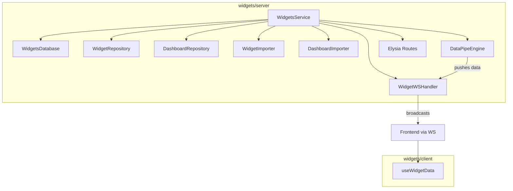

# widgets

> Backend service and client hooks for the DockStat widget/dashboard system, including database persistence, a data-pipe engine, import system, and real-time WebSocket updates.

## Overview

The `widgets` package provides a complete widget backend with:

- **Database layer** — `WidgetsDatabase` with `widgets` and `dashboards` tables
- **Repositories** — Business logic for CRUD operations, search, and default dashboard management
- **Data-pipe engine** — Topological-sort evaluation of provider → transformer → output graphs
- **Import system** — JSON manifests and ZIP archives for widgets and dashboards
- **WebSocket handler** — Real-time data updates via `@dockstat/utils/ws-handler`
- **Client hooks** — React hooks for subscribing to live widget data

## Exports

| Entry Point | Description |
|-------------|-------------|
| `widgets/server` | `WidgetsService` — main backend entry point |
| `widgets/client` | `useWidgetData` hook and shared types |

## Architecture



## Server Usage

### Mount in an Elysia App

```typescript
import { WidgetsService } from "widgets/server"
import { verifyAuthToken } from "@dockstat/auth"
import { DockStatDB } from "./database"
import BaseLogger from "./logger"

const widgetsService = new WidgetsService(DockStatDB._sqliteWrapper, BaseLogger, {
  requireAuth: true,
  verifyToken: async (token) => {
    const payload = await verifyAuthToken(token)
    return (payload?.user as Record<string, unknown>) ?? null
  },
})

// Mount all routes and WS endpoints
app.use(widgetsService.getRoutes())
```

### REST API

| Method | Path | Description |
|--------|------|-------------|
| GET | `/widgets` | List all widgets |
| GET | `/widgets/:id` | Get a widget by ID |
| POST | `/widgets` | Create a widget |
| PUT | `/widgets/:id` | Update a widget |
| DELETE | `/widgets/:id` | Delete a widget |
| GET | `/widgets/search?q=` | Search widgets |
| POST | `/widgets/import` | Import from JSON/ZIP |
| GET | `/dashboards` | List all dashboards |
| GET | `/dashboards/:id` | Get a dashboard |
| POST | `/dashboards` | Create a dashboard |
| PUT | `/dashboards/:id` | Update a dashboard |
| DELETE | `/dashboards/:id` | Delete a dashboard |
| POST | `/dashboards/import` | Import from JSON/ZIP |
| POST | `/widgets/data-pipe/evaluate/:dashboardId` | Manually evaluate data-pipe |

### WebSocket Endpoint

**Endpoint:** `/ws/widgets` (mounted at `/api/v2/ws/widgets`)

**Topics:**
- `{ type: "dashboard", dashboardId }` → `widgets/dashboard/:id`
- `{ type: "widgets" }` → `widgets/all`

**Message Envelope:**
```typescript
{
  topic: string
  data: {
    type: "data-update" | "widget-list" | "dashboard-list"
    dashboardId?: string
    payloads?: DataPayload[]
  }
  timestamp: number
}
```

### Data-Pipe Engine

The `DataPipeEngine` evaluates a graph of nodes (providers, transformers, outputs) using topological sort. Built-in providers and transformers:

| Type | Name | Description |
|------|------|-------------|
| Provider | `StaticProvider` | Returns static data |
| Provider | `TimeProvider` | Returns current timestamp |
| Transformer | `PassthroughTransformer` | Passes data through unchanged |
| Transformer | `JsonPathTransformer` | Extracts data via JSON path |
| Transformer | `ArrayFilterTransformer` | Filters array data |

```typescript
// Start periodic evaluation
widgetsService.startPollingAll(5000) // 5-second interval

// Register custom providers
widgetsService.engine.registerProvider(new MyCustomProvider())

// Graceful shutdown
widgetsService.dispose()
```

## Client Usage

### `useWidgetData(options)`

Subscribes to live widget data via the shared `WebSocketProvider` from `@dockstat/utils/react`.

```tsx
import { useWidgetData } from "widgets/client"

function Dashboard({ dashboardId }: { dashboardId: string }) {
  const { data, connected, evaluate, error } = useWidgetData({
    dashboardId,
    keys: ["cpu", "memory"], // optional: filter to specific data keys
    onUpdate: (payloads) => console.log("New data:", payloads),
  })

  return (
    <div>
      <p>Connected: {connected ? "Yes" : "No"}</p>
      <button onClick={evaluate}>Refresh</button>
      {data?.map((p) => (
        <div key={p.key}>{p.key}: {String(p.value)}</div>
      ))}
    </div>
  )
}
```

> **Note:** `useWidgetData` requires a `WebSocketProvider` from `@dockstat/utils/react` to be mounted above it, pointing to the `/api/v2/ws/widgets` endpoint.

### Types

```typescript
interface DataPayload {
  key: string
  value: unknown
  timestamp: string
  sourceNodeId: string
}

interface DashboardDefinition {
  id: string
  name: string
  label: string
  description: string
  widgets: PlacedWidget[]
  layouts: BreakpointLayouts
  dataPipe: DataPipeGraph
  isDefault: boolean
  createdAt: string
  updatedAt: string
}
```

## Code Splitting

The client entry point (`widgets/client`) imports types via `@dockstat/utils/react` — never from `@dockstat/utils/ws-handler` — to ensure server-side Elysia code is not bundled into the frontend. This preserves Vite's code splitting.

## Related Documentation

- [API WebSockets](../api-websockets) — WebSocket architecture and endpoints
- [@dockstat/utils](./@dockstat-utils) — WebSocket handler and React hooks
- [@dockstat/auth](./@dockstat-auth) — Token verification for WS auth
