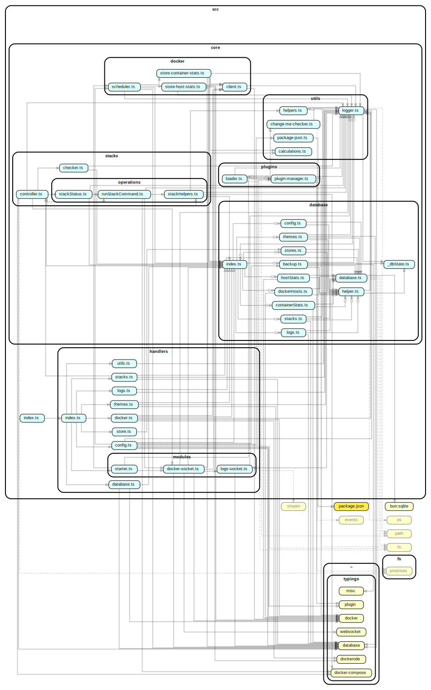

---

# DockStatAPI

Docker monitoring API with real-time statistics, stack management, and plugin support.

## Features

- Real-time container metrics via WebSocket
- Multi-host Docker environment monitoring
- Compose stack deployment/management
- Plugin system for custom logic/notifications
- Historical stats storage (SQLite)
- Swagger API documentation
- Web dashboard ([DockStat](https://github.com/its4nik/DockStat))

## Tech Stack

- **Runtime**: [Bun.sh](https://bun.sh)
- **Framework**: [Elysia.js](https://elysiajs.com/)
- **Database**: SQLite (WAL mode)
- **Docker**: dockerode + compose
- **Monitoring**: Custom metrics collection
- **Auth**: [Authentication](https://outline.itsnik.de/s/dockstat/doc/authentication-VSGhxqjtXf)

## Documentation and Wiki

Please see [DockStatAPI](https://dockstatapi.itsnik.de)

## Project Graph

### SVG:

Click [here](./dependency-graph.mmd) for the mermaid version.
