# outline-sync — `@dockstat/outline-sync`

Sync Outline (app.getoutline.com) collections ↔ Markdown in your repo.
Designed for multi-collection pipelines with intelligent conflict resolution and flexible mapping.

## ✨ Features

* **Bidirectional Sync**: Pull, push, or intelligent timestamp-based synchronization
* **Multi-Collection Support**: Handle multiple collections with `--collection` (repeatable)
* **Smart File Organization**: Folder-based storage (`<slug>/README.md`) with customizable mappings
* **Intelligent Conflict Resolution**: Whitespace/formatting-agnostic diffs with timestamp-based decisions
* **Flexible Configuration**: Per-collection mapping files and global configuration
* **Git Integration**: Uses Git commit timestamps when available (fallback to filesystem mtime)
* **Safe Operations**: Dry-run mode, automatic backups, and comprehensive logging
* **Interactive Setup**: Easy collection discovery and configuration

---

## 🚀 Quick Start

### 1. Install & Setup

```bash
# Set your API key (recommended for security)
export OUTLINE_API_KEY="sk_..."

# Interactive setup - discovers and configures collections
bunx @dockstat/outline-sync setup
```

### 2. Initialize Collections

```bash
# Bootstrap a single collection
bunx @dockstat/outline-sync init --collection="COLLECTION_UUID"

# Or multiple collections at once
bunx @dockstat/outline-sync init \
  --collection="collection-1-id" \
  --collection="collection-2-id"
```

### 3. Sync Your Content

```bash
# Dry run first (always recommended)
bunx @dockstat/outline-sync sync --collection="COLLECTION_UUID" --dry-run

# Actual synchronization
bunx @dockstat/outline-sync sync --collection="COLLECTION_UUID"

# Or sync all configured collections
bunx @dockstat/outline-sync sync
```

---

## 📖 Installation Options

### Using bunx (Recommended)
```bash
bunx @dockstat/outline-sync <command> [flags]
```

### Global Installation
```bash
npm install -g @dockstat/outline-sync
outline-sync <command> [flags]
```

> **Security Note**: Use `OUTLINE_API_KEY=...` environment variable in CI/production. The `--api-key="..."` flag is supported but may expose keys in process lists.

---

## 🎯 Commands Reference

```
Usage:
  OUTLINE_API_KEY=... bunx @dockstat/outline-sync [command] [options]

Commands:
  setup                    Interactive setup: discover and configure collections
  list-collections         List all available collections
  init --collection=ID     Bootstrap collection (create configs + download content)
  pull --collection=ID     Pull remote changes to local files
  push --collection=ID     Push local changes to remote
  sync --collection=ID     Intelligent bidirectional sync (default)

Global Options:
  --collection=ID          Target collection (repeatable for multiple collections)
  --dry-run                Preview changes without executing
  --api-key="sk_..."       Outline API key (overrides OUTLINE_API_KEY env var)
  --base-url="https://..."  Custom Outline instance URL
  --verbose                Enable debug logging
  --help, -h               Show help

Examples:
  # Interactive setup
  bunx @dockstat/outline-sync setup

  # Sync multiple collections with dry-run
  bunx @dockstat/outline-sync sync \
    --collection="id1" --collection="id2" \
    --dry-run

  # Push changes to custom Outline instance
  bunx @dockstat/outline-sync push \
    --collection="my-collection" \
    --base-url="https://outline.company.com"
```

---

## 📁 Configuration Structure

The tool uses a structured configuration approach:

```
.config/                           # Configuration directory (customizable)
├── outline-sync.json             # Global configuration
├── <collection-id>.config.json   # Per-collection mapping rules
└── <collection-id>.pages.json    # Generated page manifest
docs/                              # Content directory (customizable)
└── collection-name/
    ├── page-slug/
    │   └── README.md             # Page content
    └── parent-page/
        ├── README.md
        └── child-page/
            └── README.md
```

### Global Configuration (`outline-sync.json`)

```json
{
  "collections": [
    {
      "id": "collection-uuid-here",
      "name": "Documentation",
      "configDir": ".config",
      "saveDir": "docs/documentation",
      "pagesFile": ".config/collection-uuid-here.pages.json",
      "configFile": ".config/collection-uuid-here.config.json"
    }
  ]
}
```

### Collection Configuration (`<collection-id>.config.json`)

```json
{
  "collectionId": "collection-uuid-here",
  "saveDir": "docs/documentation",
  "mappings": [
    {
      "match": { "id": "specific-doc-id" },
      "path": "guides/getting-started/"
    },
    {
      "match": { "title": "API Reference" },
      "path": "reference/api.md"
    },
    {
      "match": { "title": "FAQ" },
      "path": "support/"
    }
  ]
}
```

### Page Manifest (`<collection-id>.pages.json`)
*Generated automatically - contains the document tree structure*

```json
{
  "collectionId": "collection-uuid-here",
  "pages": [
    {
      "title": "Getting Started",
      "file": "docs/getting-started/README.md",
      "id": "doc-id-123",
      "children": [
        {
          "title": "Installation",
          "file": "docs/getting-started/installation/README.md",
          "id": "doc-id-456",
          "children": []
        }
      ]
    }
  ]
}
```

---

## 🗂️ File Organization & Mapping

### Default Behavior: Folder-Based Structure

Each Outline document becomes a folder with `README.md`:
- Clean URLs when served
- Natural hierarchy representation
- Child documents inherit parent folders

**Example Outline Structure:**
```
Product Documentation
├── Getting Started
│   ├── Installation
│   └── Configuration
└── API Reference
    └── Authentication
```

**Generated File Structure:**
```
docs/
├── product-documentation/README.md
├── product-documentation/getting-started/README.md
├── product-documentation/getting-started/installation/README.md
├── product-documentation/getting-started/configuration/README.md
├── product-documentation/api-reference/README.md
└── product-documentation/api-reference/authentication/README.md
```

### Custom Mapping Rules

Override default paths using mapping rules in collection configuration:

```json
{
  "mappings": [
    {
      "match": { "id": "doc-123" },
      "path": "guides/setup/"
    },
    {
      "match": { "title": "API Reference" },
      "path": "reference/README.md"
    }
  ]
}
```

**Mapping Rule Types:**
- **Directory mapping** (`path/to/dir/`): Document becomes `path/to/dir/README.md`
- **File mapping** (`path/to/file.md`): Document saved as specified file
- **ID matching**: Exact document ID match (preferred)
- **Title matching**: Exact title match (fallback)

---

## 🔄 Sync Modes & Conflict Resolution

### Sync Modes

1. **`sync` (default)**: Intelligent bidirectional synchronization
   - Compares timestamps: Git commit time vs Outline `updatedAt`
   - Newer version wins
   - Ignores whitespace-only changes

2. **`pull`**: Remote → Local (one-way)
   - Outline content overwrites local files
   - Creates backups of existing files

3. **`push`**: Local → Remote (one-way)
   - Local files overwrite Outline content
   - No local file modifications

### Conflict Resolution Logic

```mermaid
flowchart TD
    A[Compare Content] --> B{Content Different?}
    B -->|No| C[Skip - No Changes]
    B -->|Yes| D[Compare Timestamps]
    D --> E{Remote Newer?}
    E -->|Yes| F[Pull Remote → Local]
    E -->|No| G{Local Newer?}
    G -->|Yes| H[Push Local → Remote]
    G -->|No| I[Skip - Same Timestamp]
```



### Content Comparison

The tool performs **whitespace-agnostic** comparisons:
- Ignores formatting differences (spaces, tabs, newlines)
- Focuses on actual content changes
- Prevents unnecessary sync operations

---

## 🛡️ Safety Features

### Backup System
- Automatic backups before overwriting files: `file.md.outline-sync.bak.timestamp`
- Preserves original content for recovery

### Dry Run Mode
```bash
# Preview all changes without executing
bunx @dockstat/outline-sync sync --dry-run
```

### Comprehensive Logging
```bash
# Enable detailed debug logging
bunx @dockstat/outline-sync sync --verbose
```

### Git Integration
- Uses Git commit timestamps when available
- Falls back to filesystem modification time
- Respects version control history

---

## 🔧 Advanced Usage

### Multiple Collections
```bash
# Sync specific collections
bunx @dockstat/outline-sync sync \
  --collection="docs-UUID1" \
  --collection="guides-UUID2" \
  --collection="api-ref-UUID3"

# Sync all configured collections (default when no --collection specified)
bunx @dockstat/outline-sync sync
```

### Custom Outline Instance
```bash
# Self-hosted or enterprise Outline
bunx @dockstat/outline-sync sync \
  --base-url="https://docs.company.com" \
  --api-key="your-api-key"
```

### CI/CD Integration
```yaml
# GitHub Actions example
- name: Sync Documentation
  env:
    OUTLINE_API_KEY: ${{ secrets.OUTLINE_API_KEY }}
  run: |
    bunx @dockstat/outline-sync sync --collection="$COLLECTION_ID"
```

---

## 🐛 Troubleshooting

### Common Issues

**"Manifest not found"**
```bash
# Solution: Initialize the collection first
bunx @dockstat/outline-sync init --collection="COLLECTION_ID"
```

**API Authentication Errors**
```bash
# Verify your API key
export OUTLINE_API_KEY="sk_your_actual_key"
bunx @dockstat/outline-sync list-collections
```

**Permission Issues**
- Ensure write permissions for `docs/` and configuration directories
- Check that API key has access to target collections

**Rate Limiting**
- Tool includes automatic retry logic with exponential backoff
- For large collections, process fewer collections simultaneously

### Debug Mode
```bash
# Get detailed operation logs
bunx @dockstat/outline-sync sync --verbose --dry-run
```

---

### Development Setup
```bash
# Clone and setup
git clone https://github.com/Its4Nik/DockStat.git
cd packages/outline-sync

# Run locally
bun run bin/cli.ts setup
bun run bin/cli.ts sync --collection="test-collection" --dry-run
```

---

## 📄 License

Mozilla Public License 2.0 (MPL-2.0)

---

## 🔗 Links

- [Repository](https://github.com/Its4Nik/DockStat/tree/main/packages/outline-sync)
- [Issues](https://github.com/Its4Nik/DockStat/issues)
- [Outline API Documentation](https://www.getoutline.com/developers)
